TP1 - Indicadores de Comercio Internacional: Marruecos
================
2026-08-29

## Introducción

Este documento presenta el cálculo de los principales indicadores de
comercio internacional (VCR, IIC, ICC) para Marruecos, país asignado en
el TP1 de Economía Internacional. Se utilizan bases de UN Comtrade/WITS
bajo nomenclatura CUCI Rev. 3 a 3 dígitos, para el período 2021-2025.

``` r
if (!requireNamespace("RColorBrewer", quietly = TRUE)) install.packages("RColorBrewer", repos = "https://cloud.r-project.org")
if (!requireNamespace("scales", quietly = TRUE)) install.packages("scales", repos = "https://cloud.r-project.org")

library(tidyverse)
library(haven)
library(ggrepel)
library(RColorBrewer)
library(scales)
```

## Formato de valores monetarios

El campo `value` de WITS viene expresado en **miles de USD**
(`TradeValueIn1000USD`). Para evitar leer, por ejemplo, “18209308” como
si ya fueran dólares (cuando en realidad son 18.209.308 miles de USD =
18,21 mil millones de USD), se define una función que convierte cada
valor a una unidad legible según su magnitud.

``` r
formatear_valor <- function(valor_miles_usd, digits_grandes = 2, digits_chicos = 1) {
  valor_usd <- valor_miles_usd * 1000
  dplyr::if_else(
    valor_usd >= 1e9,
    paste0(scales::number(valor_usd / 1e9, accuracy = 10^-digits_grandes), " mil millones USD"),
    paste0(scales::number(valor_usd / 1e6, accuracy = 10^-digits_chicos), " millones USD")
  )
}
```

## Configuración de rutas y estilo

``` r
ruta_datos <- "bases de datos/"
ruta_graficos <- "graficos/01/"

# Cantidad de bienes/países a mostrar en los desgloses del perfil de comercio
n_bienes <- 5
n_paises <- 4
```

``` r
paleta_socios <- c(
  "ESP" = "#AA151B", "FRA" = "#0055A4", "DEU" = "#FFCE00",
  "USA" = "#3C3B6E", "BRA" = "#009739"
)
nombres_socio <- c(ESP = "España", FRA = "Francia", DEU = "Alemania",
                    USA = "EE.UU.", BRA = "Brasil")

theme_tp1 <- function(base_size = 13) {
  theme_minimal(base_size = base_size, base_family = "sans") +
    theme(
      plot.title = element_text(face = "bold", size = base_size + 2, color = "gray10"),
      plot.subtitle = element_text(color = "gray35", size = base_size - 1.5, margin = margin(b = 10)),
      plot.caption = element_text(color = "gray55", size = base_size - 5, hjust = 0, margin = margin(t = 10)),
      axis.title = element_text(color = "gray25", size = base_size - 1),
      axis.text = element_text(color = "gray40"),
      legend.title = element_text(face = "bold", size = base_size - 1),
      legend.text = element_text(size = base_size - 2),
      panel.grid.minor = element_blank(),
      panel.grid.major = element_line(color = "gray92", linewidth = 0.3),
      strip.text = element_text(face = "bold", size = base_size - 1)
    )
}
```

## Carga y limpieza de datos

Se utilizan 3 bases: Marruecos como reporter contra 77 socios + el
mundo, los 5 socios finales como reporters contra el mundo (para el
ICC), y el agregado mundial (para el denominador del VCR).

``` r
limpiar_wits <- function(path, incluir_desc = TRUE) {
  base <- read_dta(path)
  names(base) <- tolower(names(base))
  base <- base %>%
    mutate(
      cuci = as.character(as_factor(productcode)),
      r    = as.character(as_factor(reporteriso3)),
      p    = as.character(as_factor(partneriso3)),
      flow = as.character(as_factor(tradeflowname))
    ) %>%
    rename(value = tradevaluein1000usd)
  if (incluir_desc) {
    base <- base %>%
      mutate(cuci_desc = as.character(as_factor(productdescription))) %>%
      select(r, p, flow, cuci, cuci_desc, value, year)
  } else {
    base <- base %>% select(r, p, flow, cuci, value, year)
  }
  base
}
```

``` r
comtrade_mar <- limpiar_wits(paste0(ruta_datos, "MAR_ALLPARTNERS_WLD.dta"))
comtrade_socios <- limpiar_wits(paste0(ruta_datos, "SOCIOS_WLD.dta"))
comtrade_wld <- limpiar_wits(paste0(ruta_datos, "WLD_WLD.dta"), incluir_desc = FALSE)
comtrade_2dig <- limpiar_wits(paste0(ruta_datos, "MAR_2DIG_WLD.dta"))
```

``` r
mar_exp <- comtrade_mar |>
  filter(flow == "Export") |>
  group_by(year, p) |>
  mutate(total_expo = sum(value, na.rm = TRUE)) |>
  ungroup() |>
  mutate(share = value / total_expo)

mar_imp <- comtrade_mar |>
  filter(flow == "Import") |>
  group_by(year, p) |>
  mutate(total_impo = sum(value, na.rm = TRUE)) |>
  ungroup() |>
  mutate(share = value / total_impo)

wld_exp <- comtrade_wld |>
  filter(flow == "Export", r == "All", p == "All") |>
  group_by(year) |>
  mutate(total_wld = sum(value, na.rm = TRUE)) |>
  ungroup() |>
  mutate(share_wld = value / total_wld) |>
  select(year, cuci, share_wld)
```

## Perfil de comercio exterior

### Principales bienes exportados e importados

``` r
top_bienes_exp <- mar_exp |>
  filter(p == "WLD", year == 2024) |>
  select(cuci, cuci_desc, value) |>
  slice_max(value, n = n_bienes) |>
  mutate(flow = "Exportado", value_fmt = formatear_valor(value))

top_bienes_imp <- mar_imp |>
  filter(p == "WLD", year == 2024) |>
  select(cuci, cuci_desc, value) |>
  slice_max(value, n = n_bienes) |>
  mutate(flow = "Importado", value_fmt = formatear_valor(value))

knitr::kable(top_bienes_exp |> select(cuci, cuci_desc, value_fmt),
             col.names = c("Código", "Producto", "Valor"),
             caption = "Principales bienes exportados por Marruecos (2024)")
```

| Código | Producto                 | Valor                  |
|:-------|:-------------------------|:-----------------------|
| 781    | Passenger cars etc       | 12.79 mil millones USD |
| 562    | Manufactured fertilizers | 12.64 mil millones USD |
| 773    | Electrical distrib equip | 10.83 mil millones USD |
| 842    | Women/girl clothing wven | 4.28 mil millones USD  |
| 784    | Motor veh parts/access   | 3.44 mil millones USD  |

Principales bienes exportados por Marruecos (2024)

``` r
knitr::kable(top_bienes_imp |> select(cuci, cuci_desc, value_fmt),
             col.names = c("Código", "Producto", "Valor"),
             caption = "Principales bienes importados por Marruecos (2024)")
```

| Código | Producto                 | Valor                 |
|:-------|:-------------------------|:----------------------|
| 334    | Heavy petrol/bitum oils  | 7.74 mil millones USD |
| 784    | Motor veh parts/access   | 6.41 mil millones USD |
| 773    | Electrical distrib equip | 3.82 mil millones USD |
| 792    | Aircraft/spacecraft/etc  | 3.00 mil millones USD |
| 772    | Electric circuit equipmt | 2.94 mil millones USD |

Principales bienes importados por Marruecos (2024)

### Evolución del comercio total y saldo comercial

``` r
comercio_total <- bind_rows(
  mar_exp |> filter(p == "WLD") |> distinct(year, total_expo) |> rename(total = total_expo) |> mutate(flujo = "Exportaciones"),
  mar_imp |> filter(p == "WLD") |> distinct(year, total_impo) |> rename(total = total_impo) |> mutate(flujo = "Importaciones")
) |>
  mutate(total_fmt = formatear_valor(total))

knitr::kable(comercio_total |> select(year, flujo, total_fmt) |> arrange(year, flujo),
             col.names = c("Año", "Flujo", "Valor"),
             caption = "Exportaciones e importaciones totales de Marruecos (2021-2025)")
```

|  Año | Flujo         | Valor                   |
|-----:|:--------------|:------------------------|
| 2021 | Exportaciones | 36.59 mil millones USD  |
| 2021 | Importaciones | 58.68 mil millones USD  |
| 2022 | Exportaciones | 42.18 mil millones USD  |
| 2022 | Importaciones | 72.58 mil millones USD  |
| 2023 | Exportaciones | 42.46 mil millones USD  |
| 2023 | Importaciones | 70.64 mil millones USD  |
| 2024 | Exportaciones | 80.57 mil millones USD  |
| 2024 | Importaciones | 97.95 mil millones USD  |
| 2025 | Exportaciones | 88.79 mil millones USD  |
| 2025 | Importaciones | 112.01 mil millones USD |

Exportaciones e importaciones totales de Marruecos (2021-2025)

``` r
g_comercio_total <- ggplot(comercio_total, aes(x = year, y = total * 1000, color = flujo)) +
  geom_line(linewidth = 1.2) + geom_point(size = 2.3) +
  scale_color_manual(values = c("Exportaciones" = "#1b4965", "Importaciones" = "#c1121f")) +
  scale_y_continuous(labels = scales::label_number(scale = 1e-9, suffix = " mil M USD")) +
  labs(title = "Evolución del comercio exterior de Marruecos",
       subtitle = "Exportaciones e importaciones totales, 2021-2025",
       x = "Año", y = NULL, color = NULL) +
  theme_tp1()
g_comercio_total
```

<figure>
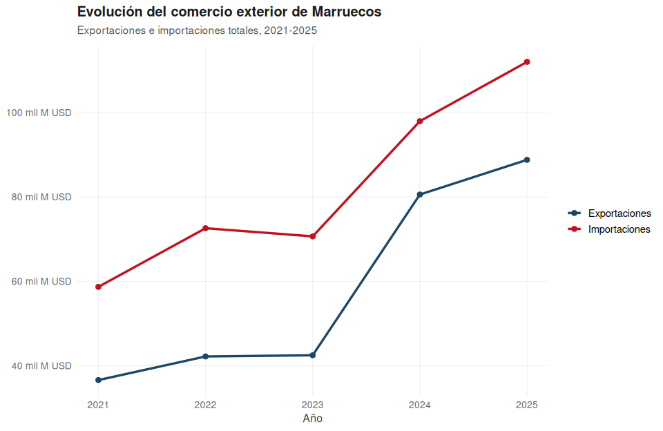
<figcaption aria-hidden="true">Evolución del comercio exterior de
Marruecos</figcaption>
</figure>

``` r
ggsave(paste0(ruta_graficos, "grafico_comercio_total.png"), g_comercio_total,
       width = 10, height = 6, dpi = 300, bg = "white")
```

``` r
saldo_comercial <- comercio_total |>
  select(year, flujo, total) |>
  pivot_wider(names_from = flujo, values_from = total) |>
  mutate(saldo = Exportaciones - Importaciones, saldo_fmt = formatear_valor(saldo))

knitr::kable(saldo_comercial |> select(year, saldo_fmt),
             col.names = c("Año", "Saldo comercial"),
             caption = "Saldo comercial de Marruecos, 2021-2025 (negativo = déficit)")
```

|  Año | Saldo comercial        |
|-----:|:-----------------------|
| 2021 | -22 092.4 millones USD |
| 2022 | -30 394.2 millones USD |
| 2023 | -28 182.2 millones USD |
| 2024 | -17 384.5 millones USD |
| 2025 | -23 222.3 millones USD |

Saldo comercial de Marruecos, 2021-2025 (negativo = déficit)

``` r
g_saldo <- ggplot(saldo_comercial, aes(x = year, y = saldo * 1000)) +
  geom_col(fill = "#780000") +
  geom_hline(yintercept = 0, color = "gray30", linewidth = 0.4) +
  scale_y_continuous(labels = scales::label_number(scale = 1e-9, suffix = " mil M USD")) +
  labs(title = "Saldo comercial de Marruecos",
       subtitle = "Exportaciones − Importaciones, 2021-2025",
       x = "Año", y = NULL) +
  theme_tp1()
g_saldo
```

<figure>
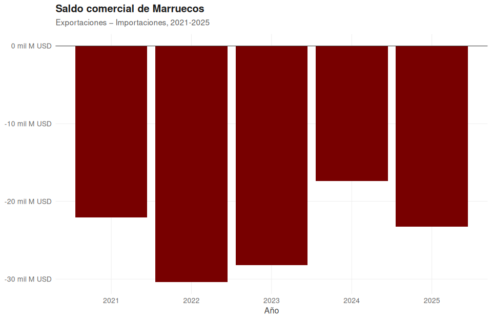
<figcaption aria-hidden="true">Saldo comercial de Marruecos</figcaption>
</figure>

``` r
ggsave(paste0(ruta_graficos, "grafico_saldo_comercial.png"), g_saldo,
       width = 10, height = 6, dpi = 300, bg = "white")
```

### Principales socios comerciales

``` r
top_socios <- mar_exp |>
  filter(p != "WLD", year == 2024) |>
  group_by(p) |>
  summarise(total = first(total_expo)) |>
  arrange(desc(total)) |>
  slice_max(total, n = 15) |>
  mutate(total_fmt = formatear_valor(total))

knitr::kable(top_socios |> select(p, total_fmt),
             col.names = c("Socio", "Exportaciones"),
             caption = "Top 15 socios comerciales de Marruecos por exportaciones (2024)")
```

| Socio | Exportaciones          |
|:------|:-----------------------|
| ESP   | 18.21 mil millones USD |
| FRA   | 15.84 mil millones USD |
| DEU   | 4.40 mil millones USD  |
| ITA   | 4.23 mil millones USD  |
| GBR   | 3.53 mil millones USD  |
| IND   | 2.69 mil millones USD  |
| BRA   | 2.62 mil millones USD  |
| USA   | 2.42 mil millones USD  |
| NLD   | 1.33 mil millones USD  |
| PRT   | 1.30 mil millones USD  |
| PAK   | 1.23 mil millones USD  |
| BEL   | 1.14 mil millones USD  |
| ROM   | 1.04 mil millones USD  |
| AUS   | 879.9 millones USD     |
| HKG   | 733.1 millones USD     |

Top 15 socios comerciales de Marruecos por exportaciones (2024)

``` r
ranking_paises_imp <- mar_imp |>
  filter(p != "WLD", year == 2024) |>
  group_by(p) |>
  summarise(total = first(total_impo)) |>
  arrange(desc(total)) |>
  slice_max(total, n = 15) |>
  mutate(total_fmt = formatear_valor(total))

knitr::kable(ranking_paises_imp |> select(p, total_fmt),
             col.names = c("Socio", "Importaciones"),
             caption = "Top 15 socios comerciales de Marruecos por importaciones (2024)")
```

| Socio | Importaciones          |
|:------|:-----------------------|
| ESP   | 16.41 mil millones USD |
| CHN   | 10.45 mil millones USD |
| FRA   | 10.32 mil millones USD |
| USA   | 8.76 mil millones USD  |
| DEU   | 5.27 mil millones USD  |
| ITA   | 4.44 mil millones USD  |
| PRT   | 3.06 mil millones USD  |
| SAU   | 2.87 mil millones USD  |
| BRA   | 1.97 mil millones USD  |
| ROM   | 1.93 mil millones USD  |
| ARE   | 1.73 mil millones USD  |
| IND   | 1.70 mil millones USD  |
| BEL   | 1.66 mil millones USD  |
| EGY   | 1.34 mil millones USD  |
| GBR   | 1.16 mil millones USD  |

Top 15 socios comerciales de Marruecos por importaciones (2024)

### Principales países por bien

Para cada uno de los principales bienes exportados e importados, se
desglosan los 4 países que más participación tienen en ese comercio
puntual, agrupando el resto en “Otros”.

``` r
desglose_pais <- function(cuci_code, flow_code, total_mundial) {
  base <- comtrade_mar |>
    filter(flow == flow_code, year == 2024, cuci == cuci_code, p != "WLD")
  top_p <- base |> slice_max(value, n = n_paises) |> select(p, value)
  resto <- total_mundial - sum(top_p$value, na.rm = TRUE)
  bind_rows(top_p, tibble(p = "Otros", value = pmax(resto, 0))) |>
    mutate(pct = round(value / total_mundial * 100, 1), value_fmt = formatear_valor(value))
}
```

``` r
tabla_paises_exp <- pmap_dfr(
  top_bienes_exp |> select(cuci, cuci_desc, value),
  function(cuci, cuci_desc, value) {
    desglose_pais(cuci, "Export", value) |> mutate(cuci_desc = cuci_desc, .before = 1)
  }
)

knitr::kable(tabla_paises_exp |> select(cuci_desc, p, value_fmt, pct),
             col.names = c("Bien", "País", "Valor", "% del total"),
             caption = "Principales países de destino de los bienes más exportados (2024)")
```

| Bien                     | País  | Valor                 | % del total |
|:-------------------------|:------|:----------------------|------------:|
| Passenger cars etc       | FRA   | 3.64 mil millones USD |        28.5 |
| Passenger cars etc       | ITA   | 2.45 mil millones USD |        19.1 |
| Passenger cars etc       | ESP   | 1.27 mil millones USD |         9.9 |
| Passenger cars etc       | DEU   | 1.22 mil millones USD |         9.5 |
| Passenger cars etc       | Otros | 4.21 mil millones USD |        32.9 |
| Manufactured fertilizers | BRA   | 2.40 mil millones USD |        19.0 |
| Manufactured fertilizers | IND   | 1.63 mil millones USD |        12.9 |
| Manufactured fertilizers | AUS   | 825.0 millones USD    |         6.5 |
| Manufactured fertilizers | ARG   | 634.9 millones USD    |         5.0 |
| Manufactured fertilizers | Otros | 7.14 mil millones USD |        56.5 |
| Electrical distrib equip | ESP   | 3.58 mil millones USD |        33.1 |
| Electrical distrib equip | FRA   | 2.20 mil millones USD |        20.3 |
| Electrical distrib equip | DEU   | 1.17 mil millones USD |        10.8 |
| Electrical distrib equip | GBR   | 1.11 mil millones USD |        10.3 |
| Electrical distrib equip | Otros | 2.76 mil millones USD |        25.5 |
| Women/girl clothing wven | ESP   | 3.38 mil millones USD |        79.0 |
| Women/girl clothing wven | FRA   | 433.3 millones USD    |        10.1 |
| Women/girl clothing wven | ITA   | 131.4 millones USD    |         3.1 |
| Women/girl clothing wven | GBR   | 117.3 millones USD    |         2.7 |
| Women/girl clothing wven | Otros | 217.5 millones USD    |         5.1 |
| Motor veh parts/access   | ESP   | 1.28 mil millones USD |        37.3 |
| Motor veh parts/access   | FRA   | 729.5 millones USD    |        21.2 |
| Motor veh parts/access   | DEU   | 323.7 millones USD    |         9.4 |
| Motor veh parts/access   | USA   | 311.9 millones USD    |         9.1 |
| Motor veh parts/access   | Otros | 792.5 millones USD    |        23.0 |

Principales países de destino de los bienes más exportados (2024)

``` r
tabla_paises_imp <- pmap_dfr(
  top_bienes_imp |> select(cuci, cuci_desc, value),
  function(cuci, cuci_desc, value) {
    desglose_pais(cuci, "Import", value) |> mutate(cuci_desc = cuci_desc, .before = 1)
  }
)

knitr::kable(tabla_paises_imp |> select(cuci_desc, p, value_fmt, pct),
             col.names = c("Bien", "País", "Valor", "% del total"),
             caption = "Principales países de origen de los bienes más importados (2024)")
```

| Bien                     | País  | Valor                 | % del total |
|:-------------------------|:------|:----------------------|------------:|
| Heavy petrol/bitum oils  | ESP   | 1.97 mil millones USD |        25.5 |
| Heavy petrol/bitum oils  | SAU   | 1.66 mil millones USD |        21.4 |
| Heavy petrol/bitum oils  | USA   | 763.7 millones USD    |         9.9 |
| Heavy petrol/bitum oils  | ITA   | 532.8 millones USD    |         6.9 |
| Heavy petrol/bitum oils  | Otros | 2.82 mil millones USD |        36.4 |
| Motor veh parts/access   | ESP   | 1.83 mil millones USD |        28.5 |
| Motor veh parts/access   | FRA   | 1.58 mil millones USD |        24.6 |
| Motor veh parts/access   | ROM   | 846.1 millones USD    |        13.2 |
| Motor veh parts/access   | PRT   | 562.3 millones USD    |         8.8 |
| Motor veh parts/access   | Otros | 1.60 mil millones USD |        25.0 |
| Electrical distrib equip | DEU   | 834.9 millones USD    |        21.8 |
| Electrical distrib equip | ESP   | 586.8 millones USD    |        15.4 |
| Electrical distrib equip | FRA   | 519.8 millones USD    |        13.6 |
| Electrical distrib equip | PRT   | 465.1 millones USD    |        12.2 |
| Electrical distrib equip | Otros | 1.42 mil millones USD |        37.0 |
| Aircraft/spacecraft/etc  | USA   | 2.08 mil millones USD |        69.5 |
| Aircraft/spacecraft/etc  | FRA   | 724.0 millones USD    |        24.2 |
| Aircraft/spacecraft/etc  | GBR   | 65.3 millones USD     |         2.2 |
| Aircraft/spacecraft/etc  | ESP   | 29.3 millones USD     |         1.0 |
| Aircraft/spacecraft/etc  | Otros | 96.3 millones USD     |         3.2 |
| Electric circuit equipmt | ESP   | 985.5 millones USD    |        33.5 |
| Electric circuit equipmt | FRA   | 801.1 millones USD    |        27.3 |
| Electric circuit equipmt | DEU   | 250.6 millones USD    |         8.5 |
| Electric circuit equipmt | CHN   | 209.5 millones USD    |         7.1 |
| Electric circuit equipmt | Otros | 692.9 millones USD    |        23.6 |

Principales países de origen de los bienes más importados (2024)

### Destino de los fertilizantes (hallazgo clave del TP)

``` r
destino_fertilizantes <- comtrade_mar |>
  filter(flow == "Export", year == 2024, cuci %in% c("272", "562"), p != "WLD") |>
  group_by(p, cuci_desc) |>
  summarise(total = sum(value, na.rm = TRUE), .groups = "drop") |>
  arrange(desc(total)) |>
  slice_max(total, n = 15) |>
  mutate(total_fmt = formatear_valor(total))

knitr::kable(destino_fertilizantes |> select(p, cuci_desc, total_fmt),
             col.names = c("Socio", "Producto", "Valor"),
             caption = "Principales destinos de fertilizantes crudos y manufacturados (2024)")
```

| Socio | Producto                 | Valor                 |
|:------|:-------------------------|:----------------------|
| BRA   | Manufactured fertilizers | 2.40 mil millones USD |
| IND   | Manufactured fertilizers | 1.63 mil millones USD |
| AUS   | Manufactured fertilizers | 825.0 millones USD    |
| ARG   | Manufactured fertilizers | 634.9 millones USD    |
| USA   | Manufactured fertilizers | 545.6 millones USD    |
| CAN   | Manufactured fertilizers | 369.3 millones USD    |
| FRA   | Manufactured fertilizers | 249.8 millones USD    |
| ESP   | Manufactured fertilizers | 248.1 millones USD    |
| IND   | Fertilizers crude        | 217.2 millones USD    |
| MEX   | Fertilizers crude        | 173.9 millones USD    |
| ROM   | Manufactured fertilizers | 139.5 millones USD    |
| NGA   | Manufactured fertilizers | 130.8 millones USD    |
| GBR   | Manufactured fertilizers | 130.0 millones USD    |
| BEL   | Manufactured fertilizers | 126.4 millones USD    |
| ITA   | Manufactured fertilizers | 116.6 millones USD    |

Principales destinos de fertilizantes crudos y manufacturados (2024)

### Principales sectores a 2 dígitos

``` r
lookup_2dig <- comtrade_2dig |>
  filter(r == "MAR", p == "WLD") |>
  distinct(cuci, cuci_desc) |>
  rename(cuci_2d = cuci, desc_2d = cuci_desc)

sectores_2dig_exp <- mar_exp |>
  filter(p == "WLD", year == 2024) |>
  mutate(cuci_2d = substr(cuci, 1, 2)) |>
  group_by(cuci_2d) |>
  summarise(total = sum(value, na.rm = TRUE)) |>
  arrange(desc(total)) |>
  slice_max(total, n = 5) |>
  left_join(lookup_2dig, by = "cuci_2d") |>
  relocate(desc_2d, .after = cuci_2d) |>
  mutate(total_fmt = formatear_valor(total))

knitr::kable(sectores_2dig_exp |> select(cuci_2d, desc_2d, total_fmt),
             col.names = c("División", "Descripción", "Valor"),
             caption = "Principales sectores exportadores a 2 dígitos (2024)")
```

| División | Descripción              | Valor                  |
|:---------|:-------------------------|:-----------------------|
| 78       | Road vehicles            | 16.40 mil millones USD |
| 77       | Electrical equipment     | 15.80 mil millones USD |
| 56       | Manufactured fertilizers | 12.64 mil millones USD |
| 84       | Apparel/clothing/access  | 7.79 mil millones USD  |
| 05       | Vegetables and fruit     | 4.64 mil millones USD  |

Principales sectores exportadores a 2 dígitos (2024)

``` r
sectores_2dig_imp <- mar_imp |>
  filter(p == "WLD", year == 2024) |>
  mutate(cuci_2d = substr(cuci, 1, 2)) |>
  group_by(cuci_2d) |>
  summarise(total = sum(value, na.rm = TRUE)) |>
  arrange(desc(total)) |>
  slice_max(total, n = 5) |>
  left_join(lookup_2dig, by = "cuci_2d") |>
  relocate(desc_2d, .after = cuci_2d) |>
  mutate(total_fmt = formatear_valor(total))

knitr::kable(sectores_2dig_imp |> select(cuci_2d, desc_2d, total_fmt),
             col.names = c("División", "Descripción", "Valor"),
             caption = "Principales sectores importadores a 2 dígitos (2024)")
```

| División | Descripción              | Valor                  |
|:---------|:-------------------------|:-----------------------|
| 77       | Electrical equipment     | 10.52 mil millones USD |
| 78       | Road vehicles            | 10.49 mil millones USD |
| 33       | Petroleum and products   | 8.12 mil millones USD  |
| 65       | Textile yarn/fabric/art. | 6.65 mil millones USD  |
| 71       | Power generating equipmt | 3.86 mil millones USD  |

Principales sectores importadores a 2 dígitos (2024)

### Composición interna de las principales divisiones

A nivel de 2 dígitos, la industria automotriz y de equipos eléctricos
superan en volumen a los fertilizantes manufacturados. Antes de
interpretar esto como una “caída” de los fertilizantes, se verifica si
se trata de un efecto de agregación: ¿cuántos productos distintos de 3
dígitos componen cada división, y qué tan concentrado está el total en
el producto principal?

``` r
# Rankeamos cada producto (3 dígitos) dentro de su propia división (2 dígitos)
# 1 = el más grande de esa división
detalle_composicion <- mar_exp |>
  filter(p == "WLD", year == 2024, substr(cuci, 1, 2) %in% sectores_2dig_exp$cuci_2d) |>
  mutate(cuci_2d = substr(cuci, 1, 2)) |>
  left_join(lookup_2dig, by = "cuci_2d") |>
  group_by(cuci_2d) |>
  mutate(
    rank_en_division = rank(-value, ties.method = "first"),
    pct_division = value / sum(value) * 100
  ) |>
  ungroup() |>
  mutate(
    categoria_rank = case_when(
      rank_en_division == 1 ~ "Producto principal",
      rank_en_division == 2 ~ "2° producto",
      rank_en_division == 3 ~ "3° producto",
      TRUE ~ "Resto"
    )
  )

# Orden de apilado explícito: Resto abajo (cerca de 0), Producto principal arriba (extremo)
orden_apilado <- c("Resto", "3° producto", "2° producto", "Producto principal")
detalle_composicion <- detalle_composicion |>
  mutate(categoria_rank = factor(categoria_rank, levels = orden_apilado))

# Acumulado por división (posiciones reales del apilado, para ubicar labels)
detalle_apilado <- detalle_composicion |>
  arrange(desc_2d, categoria_rank) |>
  group_by(desc_2d) |>
  mutate(
    ymax = cumsum(value),
    ymin = ymax - value,
    y_centro = (ymin + ymax) / 2
  ) |>
  ungroup()

# Etiqueta del producto principal
etiquetas_top <- detalle_apilado |>
  filter(rank_en_division == 1) |>
  mutate(label_completo = paste0(round(pct_division), "%"))

# Totales por división
totales_division <- detalle_apilado |>
  group_by(desc_2d) |>
  summarise(total = max(ymax), .groups = "drop")

paleta_composicion <- c(
  "Producto principal" = "#1b4965",
  "2° producto"         = "#5fa8d3",
  "3° producto"         = "#bee9e8",
  "Resto"               = "#e8e8e8"
)

g_composicion <- ggplot(detalle_apilado, aes(x = reorder(desc_2d, ymax, max))) +
  geom_rect(aes(xmin = as.numeric(reorder(desc_2d, ymax, max)) - 0.38,
                xmax = as.numeric(reorder(desc_2d, ymax, max)) + 0.38,
                ymin = ymin, ymax = ymax, fill = categoria_rank),
            color = "white", linewidth = 0.6) +
  geom_text(
    data = etiquetas_top, aes(y = y_centro, label = label_completo),
    color = "white", fontface = "bold", size = 4
  ) +
  geom_text(
    data = totales_division,
    aes(x = desc_2d, y = total, label = scales::label_number(scale = 1/1000, suffix = "M", accuracy = 0.1)(total)),
    hjust = -0.15, size = 3.8, fontface = "bold", color = "gray25", inherit.aes = FALSE
  ) +
  coord_flip(clip = "off") +
  scale_fill_manual(values = paleta_composicion) +
  scale_y_continuous(expand = expansion(mult = c(0, 0.14)), labels = NULL) +
  labs(
    title = "¿Qué tan concentrada está cada división exportadora?",
    subtitle = "Marruecos, 2024 · el % indica el peso del producto principal dentro de su división",
    x = NULL, y = NULL, fill = "Posición dentro\nde la división",
    caption = "Total exportado por división indicado al final de cada barra (millones de US$)."
  ) +
  theme_tp1(base_size = 13) +
  theme(
    axis.text.x = element_blank(),
    axis.text.y = element_text(size = 12, face = "bold", color = "gray20"),
    panel.grid.major.x = element_blank(),
    panel.grid.major.y = element_blank(),
    legend.position = "top",
    legend.justification = "left",
    plot.title.position = "plot",
    plot.margin = margin(t = 10, r = 45, b = 10, l = 10)
  )

g_composicion
```

<figure>
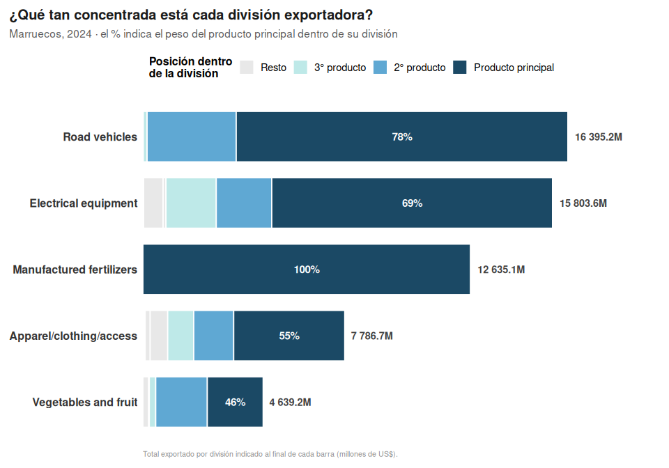
<figcaption aria-hidden="true">¿Qué tan concentrada está cada división
exportadora?</figcaption>
</figure>

``` r
ggsave(paste0(ruta_graficos, "grafico_composicion_2dig.png"), g_composicion,
       width = 10, height = 6.5, dpi = 300, bg = "white")
```

La división de fertilizantes manufacturados es, en la práctica
exportadora marroquí, prácticamente sinónimo de un único código de
producto (100% de concentración). En cambio, vehículos y equipos
eléctricos, si bien están liderados por un producto principal, se apoyan
en una cadena de varios códigos complementarios, reflejando una
integración industrial más compleja frente a la exportación directa de
una materia prima procesada.

## VCR - Ventajas Comparativas Reveladas (Balassa, 1965)

``` r
vcr_aux_mar <- mar_exp |>
  filter(p == "WLD") |>
  select(year, cuci, cuci_desc, share_mar = share)

vcr_mar <- vcr_aux_mar |>
  left_join(wld_exp, by = c("year", "cuci")) |>
  mutate(vcr = share_mar / share_wld, vcrn = (vcr - 1) / (vcr + 1)) |>
  arrange(desc(vcr))

top_ventaja <- vcr_mar |> filter(year == 2024) |> slice_max(vcrn, n = 12)
sectores_top <- top_ventaja$cuci

knitr::kable(top_ventaja |> select(cuci, cuci_desc, vcr, vcrn), digits = 3,
             caption = "Top 12 sectores con mayor VCR/VCRN (2024)")
```

| cuci | cuci_desc                |    vcr |  vcrn |
|:-----|:-------------------------|-------:|------:|
| 272  | Fertilizers crude        | 51.397 | 0.962 |
| 562  | Manufactured fertilizers | 51.322 | 0.962 |
| 773  | Electrical distrib equip | 16.683 | 0.887 |
| 522  | Elements/oxides/hal salt | 11.858 | 0.844 |
| 842  | Women/girl clothing wven | 11.816 | 0.844 |
| 036  | Crustaceans molluscs etc | 10.484 | 0.826 |
| 037  | Fish/shellfish,prep/pres |  9.916 | 0.817 |
| 054  | Vegetables,frsh/chld/frz |  6.221 | 0.723 |
| 244  | Cork natural/raw/waste   |  6.128 | 0.719 |
| 291  | Crude animal mterial nes |  5.293 | 0.682 |
| 411  | Animal oil/fat           |  4.783 | 0.654 |
| 792  | Aircraft/spacecraft/etc  |  4.756 | 0.653 |

Top 12 sectores con mayor VCR/VCRN (2024)

``` r
variacion_vcrn <- vcr_mar |>
  filter(cuci %in% sectores_top, year %in% c(2021, 2025)) |>
  select(cuci, cuci_desc, year, vcrn) |>
  pivot_wider(names_from = year, values_from = vcrn, names_prefix = "y") |>
  mutate(caida = y2025 - y2021) |>
  arrange(caida)

top_vcrn_2024 <- vcr_mar |> filter(year == 2024) |> slice_max(vcrn, n = 3) |> pull(cuci)
mayor_caida <- variacion_vcrn |> slice_min(caida, n = 2) |> pull(cuci)
sectores_reducidos <- union(top_vcrn_2024, mayor_caida)

g_vcrn <- vcr_mar |>
  filter(cuci %in% sectores_reducidos) |>
  ggplot(aes(x = year, y = vcrn, color = cuci_desc)) +
  geom_line(linewidth = 1.2) + geom_point(size = 2.2) +
  scale_color_brewer(palette = "Dark2") +
  labs(title = "Evolución del VCRN — sectores clave y de mayor caída",
       subtitle = "Marruecos, 2021-2025", x = "Año", y = "VCRN", color = "Producto") +
  theme_tp1()
g_vcrn
```

<figure>
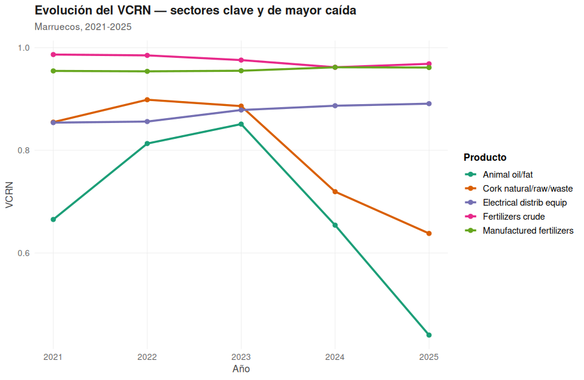
<figcaption aria-hidden="true">Evolución del VCRN — sectores clave y de
mayor caída</figcaption>
</figure>

``` r
ggsave(paste0(ruta_graficos, "grafico_evolucion_vcrn.png"), g_vcrn,
       width = 10, height = 6.5, dpi = 300, bg = "white")
```

## IIC - Índice de Intensidad Comercial (Yeats, 1997)

``` r
calcular_iic_multi <- function(socio, sectores, anio) {
  mar_soc <- mar_exp |>
    filter(p == socio, year == anio, cuci %in% sectores) |>
    select(cuci, cuci_desc, xijk = value, xij = total_expo)
  mar_wld <- mar_exp |>
    filter(p == "WLD", year == anio, cuci %in% sectores) |>
    select(cuci, xik = value, xi = total_expo)
  mar_soc |>
    left_join(mar_wld, by = "cuci") |>
    mutate(iic = as.numeric((xijk / xik) / (xij / xi)), year = anio) |>
    select(year, cuci, cuci_desc, iic)
}

top_volumen <- mar_exp |>
  filter(p == "WLD", year == 2024) |>
  select(cuci, cuci_desc, value) |>
  arrange(desc(value)) |>
  slice_max(value, n = 12) |>
  mutate(value_fmt = formatear_valor(value))

socios_finales <- c("ESP", "FRA", "DEU", "USA", "BRA")
sectores_volumen <- top_volumen$cuci
```

``` r
iic_heatmap <- map_dfr(socios_finales, function(s) {
  calcular_iic_multi(s, sectores_volumen, 2024) |> mutate(socio = s)
})

iic_heatmap_completo <- iic_heatmap |>
  tidyr::complete(socio = socios_finales, cuci, fill = list(iic = 0)) |>
  select(-cuci_desc) |>
  left_join(iic_heatmap |> distinct(cuci, cuci_desc), by = "cuci")

iic_heatmap_cat <- iic_heatmap_completo |>
  mutate(
    socio_label = factor(socio, levels = names(paleta_socios), labels = nombres_socio[names(paleta_socios)]),
    categoria = case_when(
      iic == 0 ~ "Sin comercio",
      iic < 0.5 ~ "Muy subrepresentado (<0.5)",
      iic < 1 ~ "Subrepresentado (0.5-1)",
      iic < 2 ~ "Intenso (1-2)",
      TRUE ~ "Muy intenso (>2)"
    ) |> factor(levels = c("Sin comercio", "Muy subrepresentado (<0.5)",
                            "Subrepresentado (0.5-1)", "Intenso (1-2)", "Muy intenso (>2)"))
  )

g_heatmap <- ggplot(iic_heatmap_cat, aes(x = socio_label, y = reorder(cuci_desc, iic), fill = categoria)) +
  geom_tile(color = "gray95", linewidth = 0.8) +
  geom_text(aes(label = ifelse(iic == 0, "—", round(iic, 2))), size = 3, color = "gray15") +
  scale_fill_manual(values = c(
    "Sin comercio" = "gray88", "Muy subrepresentado (<0.5)" = "#fee0d2",
    "Subrepresentado (0.5-1)" = "#fc9272", "Intenso (1-2)" = "#a1d99b", "Muy intenso (>2)" = "#31a354"
  )) +
  labs(title = "IIC de los bienes más exportados por Marruecos, por socio comercial",
       subtitle = "2024 · bienes ordenados por volumen exportado al mundo",
       x = "Socio comercial", y = NULL, fill = "Intensidad",
       caption = "IIC = 1 indica comercio bilateral proporcional al patrón exportador global de Marruecos.") +
  theme_tp1(base_size = 12) +
  theme(panel.grid = element_blank(),
        panel.background = element_rect(fill = "white", color = NA),
        plot.background = element_rect(fill = "white", color = NA),
        axis.ticks = element_blank())
g_heatmap
```

<figure>
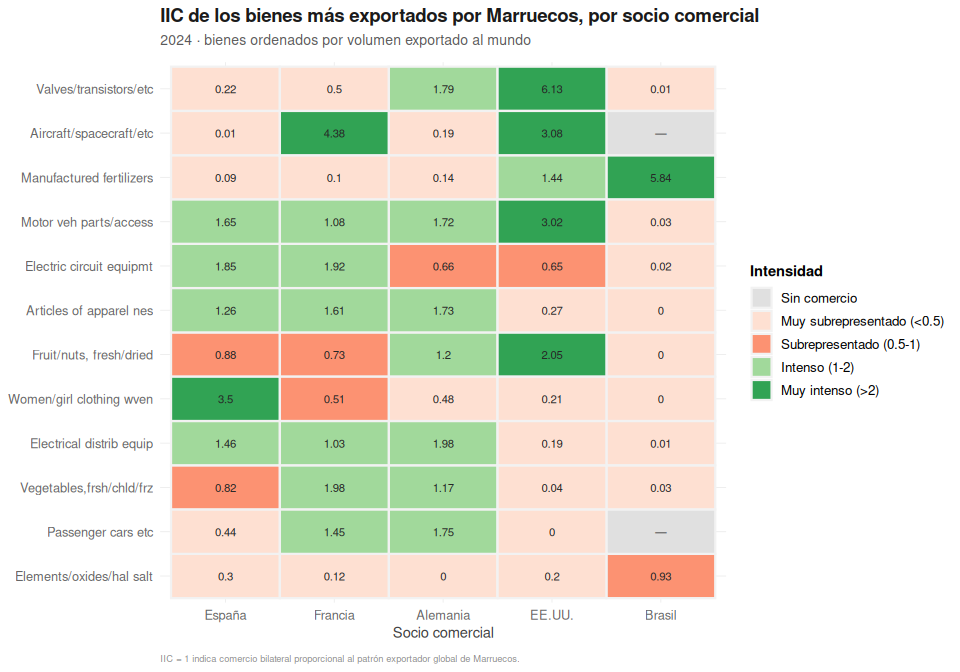
<figcaption aria-hidden="true">IIC de los bienes más exportados por
Marruecos, por socio comercial</figcaption>
</figure>

``` r
ggsave(paste0(ruta_graficos, "grafico_heatmap_iic.png"), g_heatmap,
       width = 11, height = 7, dpi = 300, bg = "white")
```

## ICC - Índice de Complementariedad Comercial (Michaely, 1996)

``` r
calcular_icc <- function(socio, anio) {
  m_mar <- mar_imp |> filter(p == "WLD", year == anio) |> select(cuci, cuci_desc, m = share)
  x_socio <- comtrade_socios |>
    filter(r == socio, p == "WLD", flow == "Export", year == anio) |>
    mutate(x = value / sum(value, na.rm = TRUE)) |>
    select(cuci, x)
  tabla <- full_join(m_mar, x_socio, by = "cuci") |>
    mutate(m = replace_na(m, 0), x = replace_na(x, 0), dif_abs = abs(m - x))
  icc <- 100 * (1 - sum(tabla$dif_abs, na.rm = TRUE) / 2)
  list(icc = icc, detalle = tabla)
}
```

``` r
candidatos <- c("ESP", "FRA", "DEU", "BRA", "IND", "CHN", "ARE", "GBR", "USA")
ranking_icc <- map_dfr(candidatos, ~tibble(socio = .x, icc = calcular_icc(.x, 2024)$icc)) |>
  arrange(desc(icc))

knitr::kable(ranking_icc, digits = 1, caption = "Ranking de ICC de Marruecos por socio comercial (2024)")
```

| socio |  icc |
|:------|-----:|
| DEU   | 56.6 |
| USA   | 56.2 |
| ESP   | 54.4 |
| FRA   | 54.3 |
| ARE   | 50.0 |
| IND   | 49.9 |
| CHN   | 48.0 |
| GBR   | 45.0 |
| BRA   | 29.8 |

Ranking de ICC de Marruecos por socio comercial (2024)

``` r
icc_evolucion <- map_dfr(2021:2025, function(a) {
  map_dfr(socios_finales, ~tibble(year = a, socio = .x, icc = calcular_icc(.x, a)$icc))
})

g_icc <- icc_evolucion |>
  filter(socio != "BRA") |>
  ggplot(aes(x = year, y = icc, color = socio)) +
  geom_line(linewidth = 1.1) + geom_point(size = 2) +
  scale_color_manual(values = paleta_socios, labels = nombres_socio) +
  labs(title = "Evolución del ICC de Marruecos por socio comercial",
       subtitle = "España, Francia, Alemania y EE.UU. — 2021-2025",
       x = "Año", y = "ICC", color = "Socio",
       caption = "Se excluye Brasil (ICC estructuralmente bajo) para no distorsionar la escala.") +
  theme_tp1()
g_icc
```

<figure>
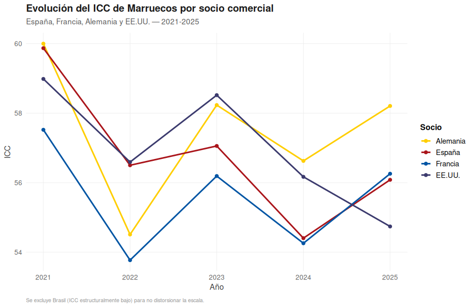
<figcaption aria-hidden="true">Evolución del ICC de Marruecos por socio
comercial</figcaption>
</figure>

``` r
ggsave(paste0(ruta_graficos, "grafico_evolucion_icc.png"), g_icc,
       width = 10, height = 6.5, dpi = 300, bg = "white")
```

## Gráfico integrador: VCR x IIC x Volumen, por socio

``` r
armar_cruce <- function(socio, anio = 2024) {
  vcr_mar |>
    filter(year == anio) |>
    select(cuci, cuci_desc, vcrn) |>
    inner_join(calcular_iic_multi(socio, unique(vcr_mar$cuci), anio) |> select(cuci, iic), by = "cuci") |>
    filter(!is.na(iic), is.finite(iic), iic > 0) |>
    left_join(mar_exp |> filter(p == socio, year == anio) |> select(cuci, value), by = "cuci") |>
    filter(!is.na(value), value > 0) |>
    mutate(socio = socio)
}

destacados_ids <- c("562", "272", "842", "773", "522")

graficar_bubble <- function(socio_code, iic_min = 0.02, n_extra = 3) {
  datos <- armar_cruce(socio_code) |> filter(iic >= iic_min)

  destacados_fijos <- datos |> filter(cuci %in% destacados_ids)
  destacados_extra <- datos |>
    filter(iic > 1, !cuci %in% destacados_ids) |>
    slice_max(value, n = n_extra)
  destacados_s <- bind_rows(destacados_fijos, destacados_extra) |>
    distinct(cuci, .keep_all = TRUE)

  n_dest <- nrow(destacados_s)
  colores_solidos <- RColorBrewer::brewer.pal(max(n_dest, 3), "Set1")[1:n_dest]
  names(colores_solidos) <- destacados_s$cuci_desc
  colores_relleno <- scales::alpha(colores_solidos, 0.35)

  rango_valor <- range(sqrt(datos$value))
  destacados_s <- destacados_s |>
    mutate(size_real = scales::rescale(sqrt(value), from = rango_valor, to = c(1, 14)))

  ggplot(datos, aes(x = vcrn, y = iic)) +
    annotate("rect", xmin = 0, xmax = Inf, ymin = 1, ymax = Inf, fill = "steelblue", alpha = 0.06) +
    annotate("rect", xmin = 0, xmax = Inf, ymin = 0, ymax = 1, fill = "firebrick", alpha = 0.06) +
    geom_hline(yintercept = 1, linetype = "dashed", color = "gray40", linewidth = 0.4) +
    geom_vline(xintercept = 0, linetype = "dashed", color = "gray40", linewidth = 0.4) +
    geom_point(aes(size = value), shape = 21, color = "gray50", fill = scales::alpha("gray50", 0.15), stroke = 0.4) +
    geom_point(data = destacados_s, aes(size = value, color = cuci_desc, fill = cuci_desc), shape = 21, stroke = 1.1) +
    geom_text_repel(
      data = destacados_s, aes(label = cuci_desc, color = cuci_desc),
      size = 3.3, fontface = "bold", show.legend = FALSE,
      point.size = destacados_s$size_real, box.padding = 1, min.segment.length = 0,
      segment.color = "gray50", force = 10, max.iter = 15000
    ) +
    scale_y_log10(labels = scales::label_number(accuracy = 0.01)) +
    scale_x_continuous(limits = c(-1.05, 1.05), breaks = seq(-1, 1, 0.5)) +
    scale_size_continuous(range = c(1, 14)) +
    scale_color_manual(values = colores_solidos) +
    scale_fill_manual(values = colores_relleno) +
    guides(color = "none", fill = "none", size = "none") +
    labs(
      title = paste("VCR vs. IIC — Marruecos hacia", nombres_socio[socio_code]),
      subtitle = "2024 · el tamaño del punto es el valor exportado",
      x = "VCRN — ventaja comparativa revelada normalizada", y = "IIC (escala log)",
      caption = paste0(
        "Línea punteada horizontal: IIC = 1 · vertical: VCRN = 0\n",
        "Se excluyen productos con IIC < ", iic_min, ". Etiquetas: 5 productos de referencia",
        if (n_extra > 0) paste0(" + hasta ", n_extra, " de mayor volumen con IIC > 1 propios de este socio.") else "."
      )
    ) +
    theme_tp1()
}

umbrales_iic <- c(ESP = 0.02, FRA = 0.02, DEU = 0.001, USA = 0.02, BRA = 0.02)
```

### España

``` r
p_esp <- graficar_bubble("ESP", iic_min = umbrales_iic[["ESP"]])
p_esp
```

<figure>
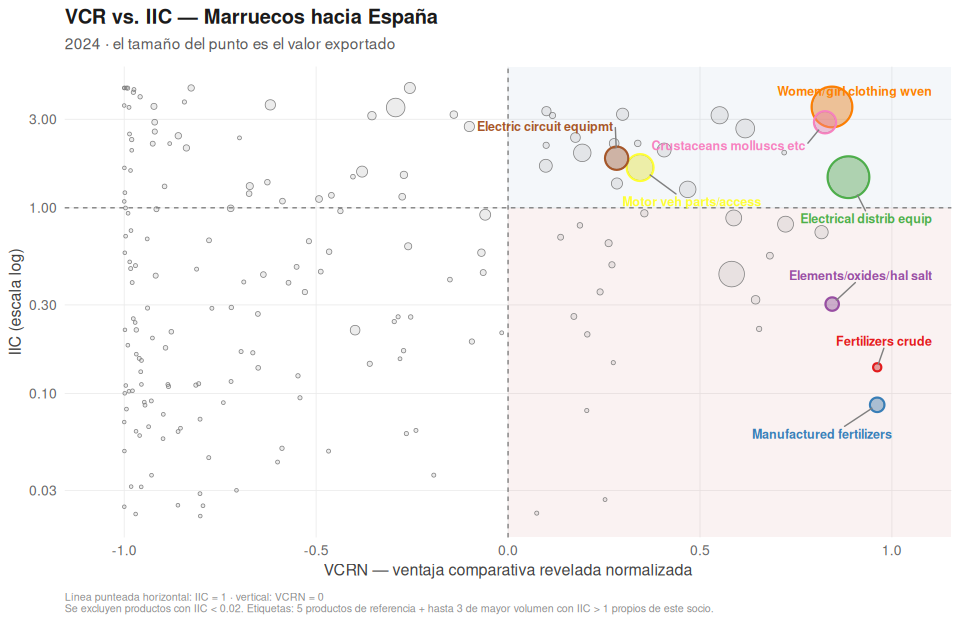
<figcaption aria-hidden="true">VCR vs. IIC — Marruecos hacia
España</figcaption>
</figure>

``` r
ggsave(paste0(ruta_graficos, "bubble_ESP.png"), p_esp, width = 10, height = 6.5, dpi = 300, bg = "white")
```

### Francia

``` r
p_fra <- graficar_bubble("FRA", iic_min = umbrales_iic[["FRA"]])
p_fra
```

<figure>
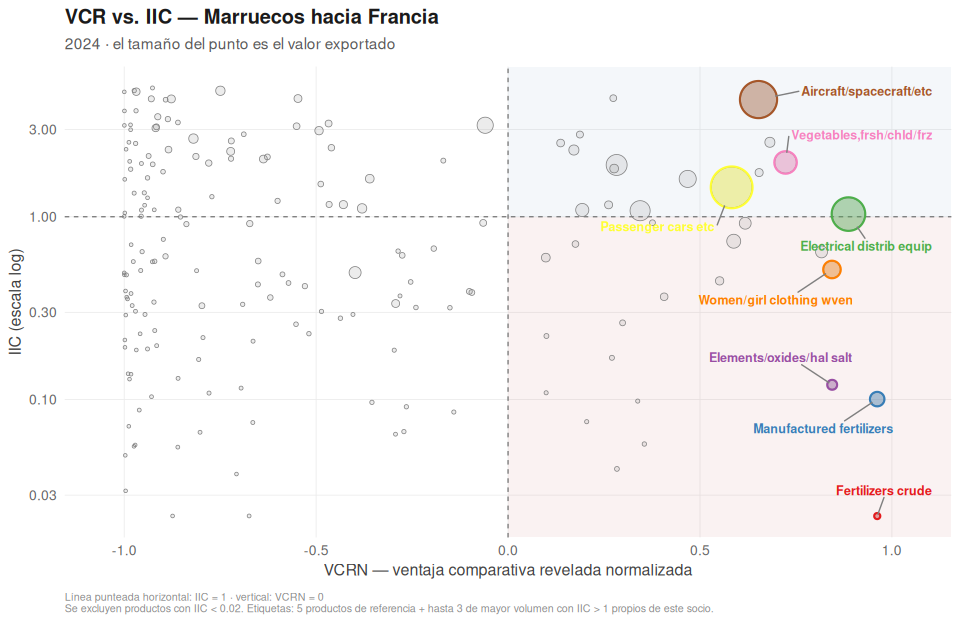
<figcaption aria-hidden="true">VCR vs. IIC — Marruecos hacia
Francia</figcaption>
</figure>

``` r
ggsave(paste0(ruta_graficos, "bubble_FRA.png"), p_fra, width = 10, height = 6.5, dpi = 300, bg = "white")
```

### Alemania

``` r
p_deu <- graficar_bubble("DEU", iic_min = umbrales_iic[["DEU"]])
p_deu
```

<figure>
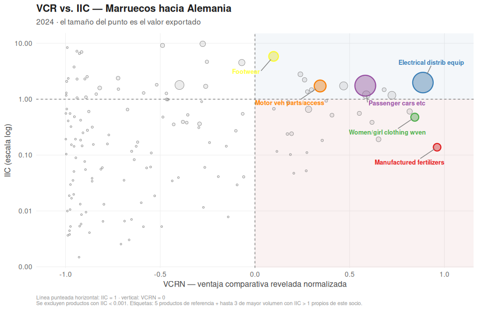
<figcaption aria-hidden="true">VCR vs. IIC — Marruecos hacia
Alemania</figcaption>
</figure>

``` r
ggsave(paste0(ruta_graficos, "bubble_DEU.png"), p_deu, width = 10, height = 6.5, dpi = 300, bg = "white")
```

### EE.UU.

``` r
p_usa <- graficar_bubble("USA", iic_min = umbrales_iic[["USA"]])
p_usa
```

<figure>
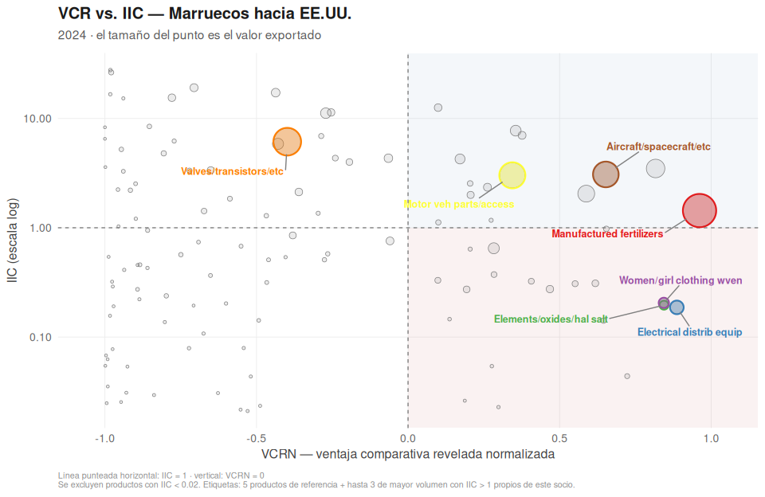
<figcaption aria-hidden="true">VCR vs. IIC — Marruecos hacia
EE.UU.</figcaption>
</figure>

``` r
ggsave(paste0(ruta_graficos, "bubble_USA.png"), p_usa, width = 10, height = 6.5, dpi = 300, bg = "white")
```

### Brasil

``` r
p_bra <- graficar_bubble("BRA", iic_min = umbrales_iic[["BRA"]])
p_bra
```

<figure>
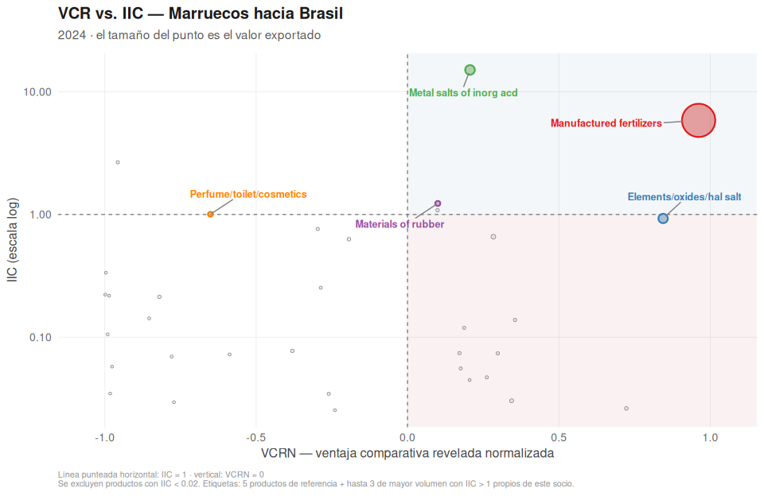
<figcaption aria-hidden="true">VCR vs. IIC — Marruecos hacia
Brasil</figcaption>
</figure>

``` r
ggsave(paste0(ruta_graficos, "bubble_BRA.png"), p_bra, width = 10, height = 6.5, dpi = 300, bg = "white")
```
