- [Introducción](#introducción)
- [Herencia del TP1](#herencia-del-tp1)
- [Carga y parseo de la base de investigación (Gemini
  Spark)](#carga-y-parseo-de-la-base-de-investigación-gemini-spark)
  - [Reconstrucción de las tablas
    base](#reconstrucción-de-las-tablas-base)
  - [Vista rápida: contraste contra la Sheet de
    Spark](#vista-rápida-contraste-contra-la-sheet-de-spark)
- [Bloque 1 - Punto de partida](#bloque-1---punto-de-partida)
- [Bloque 2 - Modelo de Factores Específicos (corto
  plazo)](#bloque-2---modelo-de-factores-específicos-corto-plazo)
  - [La FPP real de Marruecos](#la-fpp-real-de-marruecos)
  - [Caja de asignación del trabajo y el hallazgo de la brecha
    institucional](#caja-de-asignación-del-trabajo-y-el-hallazgo-de-la-brecha-institucional)
  - [¿Cobb-Douglas es la tecnología correcta para extrapolar
    esto?](#cobb-douglas-es-la-tecnología-correcta-para-extrapolar-esto)
  - [Shock de términos de
    intercambio](#shock-de-términos-de-intercambio)
- [Bloque 3 - Modelo de Heckscher-Ohlin (largo
  plazo)](#bloque-3---modelo-de-heckscher-ohlin-largo-plazo)
- [Bloque 4 - Síntesis y política](#bloque-4---síntesis-y-política)
- [Conclusiones](#conclusiones)

## Introducción

Este documento aplica el Modelo de Factores Específicos (MFE, corto
plazo) y el Modelo de Heckscher-Ohlin (HO, largo plazo) a Marruecos,
retomando del TP1 los dos sectores exportadores con mayor peso
narrativo: **fosfatos** (fertilizantes, CUCI 272/562) y **automotor**
(CUCI 781/784). Todas las cifras sectoriales (OCP, USGS, OICA, Office
des Changes, HCP, CNSS, UNCTADstat, AMDIE, Caisse de Compensation) se
leen de una base compilada mediante investigación web dirigida con un
agente de IA (Gemini, modelo Gemini Spark) en dos rondas, no de números
tipeados a mano - cada dato trae su fuente primaria, URL exacta y fecha
de consulta. Ver `TP2_fuentes_de_datos.md` y
`TP2_seguimiento_investigacion_ronda2.md` para el detalle completo de
esa investigación.

``` r
paquetes_nuevos <- c("WDI", "pwt10", "readxl", "RColorBrewer", "scales", "ggrepel")
for (pkg in paquetes_nuevos) {
  if (!requireNamespace(pkg, quietly = TRUE)) install.packages(pkg, repos = "https://cloud.r-project.org")
}

library(tidyverse)
library(haven)
library(WDI)
library(pwt10)
library(readxl)
library(ggrepel)
library(RColorBrewer)
library(scales)
```

## Herencia del TP1

Se cargan los objetos del TP1 (bases limpias, VCR/VCRN por producto y
año, IIC por socio, tema visual, paletas) para no recalcular nada que ya
esté resuelto ahí.

``` r
objetos_tp1 <- "output/tablas/01/objetos_heredados_tp1.RData"
objetos_necesarios <- c("vcr_mar", "iic_heatmap_completo", "mar_exp", "theme_tp1", "nombres_socio")

if (file.exists(objetos_tp1)) {
  load(objetos_tp1)
}
# Si el .RData no existe, o existe pero no trae todos los objetos que
# necesita este script (por ejemplo porque el save() del Bloque 8 del TP1
# quedó desactualizado), se corre el TP1 completo en vez de fallar a mitad
# de camino con un "objeto no encontrado" más adelante.
if (!all(objetos_necesarios %in% ls())) {
  source("scripts/FINAL/01/01_INDICADORES_FINAL.R", print.eval = FALSE)
}
```

``` r
ruta_graficos <- "output/graficos/02/"
ruta_tablas   <- "output/tablas/02/"
if (!dir.exists(ruta_graficos)) dir.create(ruta_graficos, recursive = TRUE)
if (!dir.exists(ruta_tablas))   dir.create(ruta_tablas, recursive = TRUE)

paleta_sectores  <- c("Fosfatos" = "#1b4965", "Automotor" = "#c1121f")
paleta_paises_ho <- c("Morocco" = "#c1272d", "Germany" = "#FFCE00",
                      "Spain" = "#AA151B", "France" = "#0055A4")

sectores_mfe <- c("272", "562", "781", "784")
nombres_sectores_mfe <- c(
  "272" = "Fertilizantes crudos", "562" = "Fertilizantes manufacturados",
  "781" = "Autos de pasajeros",   "784" = "Autopartes"
)
```

## Carga y parseo de la base de investigación (Gemini Spark)

La búsqueda y extracción de cada dato fue ejecutada por un agente de IA
(Gemini, modelo Gemini Spark) a partir de instrucciones puntuales sobre
qué fuentes primarias consultar (OCP, USGS, Office des Changes, HCP,
CNSS, UNCTADstat, AMDIE, Ministère de l’Industrie) - no generada desde
el conocimiento propio del modelo. La columna `Valor` de la planilla
mezcla números limpios, “NO ENCONTRADO”, rangos de texto (“75% - 85%”) y
fracciones ya decimales (0.635) para las mismas magnitudes en otras
filas - el parser de abajo cubre las tres formas.

``` r
# AJUSTAR ESTA RUTA si el Excel queda en otra carpeta o con otro nombre.
ruta_investigacion <- "bases de datos/TP2_Economia_Internacional_Marruecos_Fuentes_de_Datos.xlsx"
```

``` r
leer_hoja_investigacion <- function(ruta, hoja) {
  read_excel(ruta, sheet = hoja) |>
    set_names(c("bloque", "punto", "variable", "valor_raw", "unidad",
                "anio", "fuente", "url", "fecha_consulta", "notas"))
}
```

``` r
parsear_valor <- function(valor_raw) {
  x <- str_trim(as.character(valor_raw))
  es_no_encontrado <- str_detect(x, regex("NO ENCONTRADO", ignore_case = TRUE))
  es_rango <- str_detect(x, "-") & !es_no_encontrado & str_detect(x, "\\d")
  es_pct_texto <- str_detect(x, "%")

  limpiar_num <- function(s) as.numeric(str_trim(str_remove_all(s, "%")))

  valor_min <- rep(NA_real_, length(x))
  valor_max <- rep(NA_real_, length(x))
  partes <- str_split(x, "-")
  for (i in seq_along(x)) {
    if (isTRUE(es_rango[i]) && length(partes[[i]]) == 2) {
      valor_min[i] <- limpiar_num(partes[[i]][1])
      valor_max[i] <- limpiar_num(partes[[i]][2])
    }
  }

  valor_unico <- ifelse(es_no_encontrado | es_rango, NA_real_, suppressWarnings(limpiar_num(x)))
  valor_unico[es_pct_texto & !es_rango] <- valor_unico[es_pct_texto & !es_rango] / 100
  valor_min[es_pct_texto & es_rango] <- valor_min[es_pct_texto & es_rango] / 100
  valor_max[es_pct_texto & es_rango] <- valor_max[es_pct_texto & es_rango] / 100

  tibble(
    valor = valor_unico, valor_min = valor_min, valor_max = valor_max,
    valor_medio = ifelse(es_rango, (valor_min + valor_max) / 2, valor_unico)
  )
}
```

``` r
datos_investigacion <- bind_rows(
  leer_hoja_investigacion(ruta_investigacion, "Ronda 1") |> mutate(ronda = 1),
  leer_hoja_investigacion(ruta_investigacion, "Ronda 2 - Profundización") |> mutate(ronda = 2)
) |>
  mutate(anio = as.integer(anio))

datos_investigacion <- bind_cols(datos_investigacion, parsear_valor(datos_investigacion$valor_raw))

extraer_serie <- function(nombre_variable, columna = "valor") {
  datos_investigacion |>
    filter(variable == nombre_variable) |>
    select(anio, all_of(columna)) |>
    rename(year = anio) |>
    arrange(year)
}
```

``` r
sin_convertir <- datos_investigacion |>
  filter(is.na(valor) & is.na(valor_medio) &
           !str_detect(valor_raw, regex("NO ENCONTRADO", ignore_case = TRUE))) |>
  select(variable, valor_raw, anio)

knitr::kable(sin_convertir, caption = "Filas que no se pudieron convertir a número (revisar si no está vacío)")
```

| variable | valor_raw | anio |
|:---|:---|---:|
| Crecimiento volumen VA - Minería (B00) | -4.2 | 2023 |
| Régimen de zonas francas e incentivos fiscales a la inversión automotriz | Exoneración IS 5 años + 15% posterior; primas hasta 30% | 2023 |

Filas que no se pudieron convertir a número (revisar si no está vacío)

### Reconstrucción de las tablas base

``` r
ocp_financieros <- extraer_serie("Ingresos (Chiffre d'affaires)") |> rename(ingresos_mmad = valor)
ocp_financieros <- full_join(ocp_financieros,
  extraer_serie("EBITDA") |> rename(ebitda_mmad = valor), by = "year")
ocp_financieros <- full_join(ocp_financieros,
  extraer_serie("Gastos de capital (Capex)") |> rename(capex_mmad = valor), by = "year")
ocp_financieros <- full_join(ocp_financieros,
  extraer_serie("Dividendos pagados al Tesoro marroquí") |> rename(dividendos_mmad = valor), by = "year") |>
  arrange(year)

ocp_empleo_serie <- extraer_serie("Empleo directo OCP Group (Fosfatos)") |> rename(empleo = valor)
ocp_empleo_consolidado_alt <- 20000
```

``` r
fosfatos_reservas <- extraer_serie("Reservas de roca fosfórica (Marruecos)") |> rename(reservas_mt = valor)
unidad_reservas <- datos_investigacion |>
  filter(variable == "Reservas de roca fosfórica (Marruecos)") |>
  pull(unidad) |> unique() |> first()
fosfatos_produccion <- extraer_serie("Producción física de roca fosfórica") |> rename(produccion_mt = valor)
```

``` r
auto_produccion <- extraer_serie("Producción de vehículos de motor") |> rename(unidades = valor)

auto_empleo_serie <- bind_rows(
  datos_investigacion |>
    filter(variable == "Empleo total sector automotor") |>
    transmute(year = anio, empleo = valor, nota = "declarado/observado"),
  datos_investigacion |>
    filter(variable == "Empleo total sector automotor (meta proyectada)") |>
    transmute(year = anio, empleo = valor, nota = "meta proyectada, no observada")
) |>
  arrange(year)

auto_exportaciones_oc <- extraer_serie("Exportaciones sector automotor (Total)") |> rename(total_mmad = valor)
auto_exportaciones_oc <- full_join(auto_exportaciones_oc,
  extraer_serie("Exportaciones automotrices - Segmento Câblage (Cableado)") |> rename(cableado_mmad = valor),
  by = "year")
auto_exportaciones_oc <- full_join(auto_exportaciones_oc,
  extraer_serie("Exportaciones automotrices - Segmento Construction (Ensamble)") |> rename(ensamblaje_mmad = valor),
  by = "year")
auto_exportaciones_oc <- full_join(auto_exportaciones_oc,
  extraer_serie("Exportaciones Phosphates et dérivés (Referencia cruce)") |> rename(fosfatos_ref_mmad = valor),
  by = "year") |>
  arrange(year)
```

``` r
io_coeficientes <- datos_investigacion |>
  filter(str_detect(variable, "^Coeficiente")) |>
  mutate(
    rama = case_when(
      str_detect(variable, "Minería") ~ "Minería/fosfatos (B00)",
      str_detect(variable, "Automotor") ~ "Automotor/IMME (C00)"
    ),
    tipo = case_when(
      str_detect(variable, "^Coeficiente capital") ~ "capital",
      str_detect(variable, "^Coeficiente trabajo") ~ "trabajo",
      str_detect(variable, "insumo-producto") ~ "ci_produccion"
    )
  ) |>
  select(rama, tipo, valor_min, valor_max) |>
  pivot_wider(names_from = tipo, values_from = c(valor_min, valor_max),
              names_glue = "{tipo}_va_{.value}") |>
  rename_with(~ str_replace(., "valor_", ""), everything()) |>
  mutate(capital_va_medio = (capital_va_min + capital_va_max) / 2,
         trabajo_va_medio = (trabajo_va_min + trabajo_va_max) / 2)
```

``` r
salario_promedio_general <- extraer_serie("Salario medio mensual declarado - Total cotizantes régimen general") |>
  rename(salario_mad_mes = valor)

salarios_cnss_sector_2020 <- datos_investigacion |>
  filter(str_starts(variable, "Salario medio declarado -"), anio == 2020) |>
  transmute(sector = str_remove(variable, "^Salario medio declarado - "), salario_mad_mes = valor)
```

``` r
ied_stock_total <- extraer_serie("Stock de IED entrante en Marruecos (Inward FDI Stock)") |> rename(stock_musd = valor)

ied_origen_pais_2020 <- datos_investigacion |>
  filter(str_starts(variable, "Stock de IED entrante originario de"), anio == 2020) |>
  transmute(pais = str_remove(variable, "^Stock de IED entrante originario de "), stock_mmad = valor_medio)

auto_inversion <- bind_rows(
  datos_investigacion |>
    filter(str_starts(variable, "Inversión")) |>
    transmute(entidad = str_remove(variable, "^Inversión (acumulada|comprometida) "),
              monto_mmad = valor, año_corte = anio),
  datos_investigacion |>
    filter(str_starts(variable, "Inversiones")) |>
    transmute(entidad = str_remove(variable, "^Inversiones comprometidas "),
              monto_mmad = valor, año_corte = anio)
)

ied_manufactura <- extraer_serie("Stock de IED en industria manufacturera") |> rename(stock_mmad = valor)
ied_manufactura_flujo <- datos_investigacion |>
  filter(variable == "Flujo neto anual de IED manufacturera") |>
  select(anio, valor_min, valor_max)
```

``` r
hcp_va_crecimiento <- extraer_serie("Crecimiento volumen VA - Minería (B00)") |> rename(mineria_pct = valor)
hcp_va_crecimiento <- full_join(hcp_va_crecimiento,
  extraer_serie("Crecimiento volumen VA - Manufactura (C00)") |> rename(manufactura_pct = valor),
  by = "year") |> arrange(year)

hcp_va_total_mmad <- extraer_serie("Valor agregado total economía (precios básicos)") |> rename(total = valor)

caisse_compensacion <- bind_rows(
  datos_investigacion |>
    filter(variable == "Carga global de compensación (Caisse de Compensation)") |>
    transmute(year = anio, carga_mmad = valor, nota = NA_character_),
  datos_investigacion |>
    filter(variable == "Carga global de compensación presupuestada") |>
    transmute(year = anio, carga_mmad = valor, nota = "presupuestado, Loi de Finances")
) |>
  arrange(year)

regimen_amdie_texto <- datos_investigacion |>
  filter(variable == "Régimen de zonas francas e incentivos fiscales a la inversión automotriz") |>
  pull(valor_raw)

precios_internacionales <- extraer_serie("Precio internacional DAP (f.o.b. US Gulf)") |> rename(dap_usd_mt = valor)
precios_internacionales <- full_join(precios_internacionales,
  extraer_serie("Precio internacional roca fosfórica (f.o.b. North Africa)") |> rename(roca_fosforica_usd_mt = valor),
  by = "year")
precios_internacionales <- full_join(precios_internacionales,
  extraer_serie("Precio internacional gas natural (Europe TTF)") |> rename(gas_natural_usd_mmbtu = valor),
  by = "year") |>
  arrange(year)
```

### Vista rápida: contraste contra la Sheet de Spark

Cada tabla de abajo debería coincidir con lo que se ve en las pestañas
“Ronda 1” / “Ronda 2 - Profundización” de la Sheet.

``` r
knitr::kable(ocp_financieros, caption = "OCP - financieros (millones de MAD)")
```

| year | ingresos_mmad | ebitda_mmad | capex_mmad | dividendos_mmad |
|-----:|--------------:|------------:|-----------:|----------------:|
| 2021 |         84300 |       36269 |      13135 |            5126 |
| 2022 |        114574 |       50076 |      20011 |            8163 |
| 2023 |         91277 |       29396 |      26825 |            7251 |
| 2024 |         97000 |       38800 |         NA |              NA |

OCP - financieros (millones de MAD)

``` r
knitr::kable(ocp_empleo_serie, caption = "OCP - empleo directo")
```

| year | empleo |
|-----:|-------:|
| 2019 |  20000 |
| 2020 |  18357 |
| 2021 |  17961 |
| 2022 |  17688 |
| 2023 |  17000 |
| 2024 |  20000 |
| 2025 |     NA |

OCP - empleo directo

``` r
knitr::kable(fosfatos_reservas,
  caption = paste0("USGS - reservas de roca fosfórica (unidad tal como figura en la planilla de Spark: \"",
                    unidad_reservas, "\" - CONFIRMAR contra la fuente original antes de citar; ",
                    "hubo una discrepancia entre lecturas anteriores del mismo dato))"))
```

| year | reservas_mt |
|-----:|------------:|
| 2024 |       5e+07 |
| 2025 |       5e+07 |

USGS - reservas de roca fosfórica (unidad tal como figura en la planilla
de Spark: “Miles de toneladas métricas” - CONFIRMAR contra la fuente
original antes de citar; hubo una discrepancia entre lecturas anteriores
del mismo dato))

``` r
knitr::kable(fosfatos_produccion, caption = "USGS - producción física de roca fosfórica (miles de toneladas)")
```

| year | produccion_mt |
|-----:|--------------:|
| 2019 |         35200 |
| 2020 |         37400 |
| 2021 |         38100 |
| 2022 |         38000 |
| 2023 |         33000 |
| 2024 |         35300 |
| 2025 |         36000 |

USGS - producción física de roca fosfórica (miles de toneladas)

``` r
knitr::kable(auto_produccion, caption = "OICA - producción de vehículos")
```

| year | unidades |
|-----:|---------:|
| 2019 |   403218 |
| 2021 |   403007 |
| 2022 |   464864 |
| 2023 |   535825 |
| 2024 |   559645 |
| 2025 |   501965 |

OICA - producción de vehículos

``` r
knitr::kable(auto_empleo_serie, caption = "Empleo total del sector automotor")
```

| year | empleo | nota                          |
|-----:|-------:|:------------------------------|
| 2019 | 148000 | declarado/observado           |
| 2020 | 160000 | declarado/observado           |
| 2021 | 180000 | declarado/observado           |
| 2022 | 220000 | declarado/observado           |
| 2023 | 230000 | declarado/observado           |
| 2024 | 238000 | declarado/observado           |
| 2025 | 250000 | meta proyectada, no observada |

Empleo total del sector automotor

``` r
knitr::kable(auto_exportaciones_oc,
  caption = paste0("Office des Changes - exportaciones automotrices y fosfatos de referencia. ",
                    "Cableado + ensamblaje no suman el total: son los dos subsegmentos más grandes ",
                    "(~75-80% del total), no una descomposición exhaustiva - el resto son interiores, ",
                    "asientos, powertrain y piezas estampadas."))
```

| year | total_mmad | cableado_mmad | ensamblaje_mmad | fosfatos_ref_mmad |
|-----:|-----------:|--------------:|----------------:|------------------:|
| 2019 |      77128 |         33500 |           34000 |             48923 |
| 2020 |      72283 |         25695 |           29216 |             50869 |
| 2021 |      83783 |         25206 |           39491 |             79893 |
| 2022 |     111281 |         34810 |           55149 |            115484 |
| 2023 |     141763 |         46136 |           67629 |             76141 |
| 2024 |     157594 |         53643 |           70955 |             87083 |
| 2025 |     154494 |         57777 |           61299 |             99804 |

Office des Changes - exportaciones automotrices y fosfatos de
referencia. Cableado + ensamblaje no suman el total: son los dos
subsegmentos más grandes (~75-80% del total), no una descomposición
exhaustiva - el resto son interiores, asientos, powertrain y piezas
estampadas.

``` r
knitr::kable(io_coeficientes, digits = 3, caption = "Coeficientes de reparto del VA por rama (HCP, TRE Base 2014)")
```

| rama | capital_va_min | trabajo_va_min | ci_produccion_va_min | capital_va_max | trabajo_va_max | ci_produccion_va_max | capital_va_medio | trabajo_va_medio |
|:---|---:|---:|---:|---:|---:|---:|---:|---:|
| Minería/fosfatos (B00) | 0.75 | 0.12 | 0.35 | 0.85 | 0.20 | 0.45 | 0.80 | 0.16 |
| Automotor/IMME (C00) | 0.50 | 0.38 | 0.68 | 0.60 | 0.48 | 0.78 | 0.55 | 0.43 |

Coeficientes de reparto del VA por rama (HCP, TRE Base 2014)

``` r
knitr::kable(salario_promedio_general, caption = "CNSS - salario promedio general")
```

| year | salario_mad_mes |
|-----:|----------------:|
| 2019 |            5255 |
| 2023 |            5500 |
| 2024 |            5871 |

CNSS - salario promedio general

``` r
knitr::kable(salarios_cnss_sector_2020, caption = "CNSS - salario por sector (2020)")
```

| sector                                      | salario_mad_mes |
|:--------------------------------------------|----------------:|
| Industrie (Manufacturas, incluye automotor) |            5002 |
| Agriculture, forêt et pêche                 |            2975 |
| Transports et entreposage                   |            6520 |
| Activités financières et d’assurance        |           14937 |

CNSS - salario por sector (2020)

``` r
knitr::kable(ied_stock_total, caption = "UNCTADstat - stock de IED entrante, total")
```

| year | stock_musd |
|-----:|-----------:|
| 2019 |      66500 |
| 2020 |      67500 |
| 2021 |      72994 |
| 2022 |      63278 |
| 2023 |      69297 |
| 2024 |      71500 |

UNCTADstat - stock de IED entrante, total

``` r
knitr::kable(ied_origen_pais_2020, caption = "IED por país de origen (2020)")
```

| pais                   | stock_mmad |
|:-----------------------|-----------:|
| Francia                |     194400 |
| Emiratos Árabes Unidos |     132400 |
| España                 |      53100 |
| Países Bajos           |      27500 |
| Estados Unidos         |      22500 |

IED por país de origen (2020)

``` r
knitr::kable(auto_inversion, caption = "Inversión en el sector automotor")
```

| entidad                                | monto_mmad | año_corte |
|:---------------------------------------|-----------:|----------:|
| Renault Group (Tánger y SOMACA)        |      14000 |      2022 |
| Stellantis (Kenitra)                   |       9000 |      2022 |
| gigafactorías de baterías (Gotion/BTR) |      20000 |      2024 |

Inversión en el sector automotor

``` r
knitr::kable(hcp_va_crecimiento, caption = "HCP - crecimiento de VA por rama")
```

| year | mineria_pct | manufactura_pct |
|-----:|------------:|----------------:|
| 2023 |          NA |             3.2 |
| 2024 |        11.5 |             2.1 |
| 2025 |         7.5 |             1.9 |

HCP - crecimiento de VA por rama

``` r
knitr::kable(hcp_va_total_mmad, caption = "HCP - valor agregado total")
```

| year |   total |
|-----:|--------:|
| 2023 | 1340158 |
| 2024 | 1440407 |
| 2025 | 1517747 |

HCP - valor agregado total

``` r
knitr::kable(caisse_compensacion, caption = "Caisse de Compensation - carga anual")
```

| year | carga_mmad | nota                           |
|-----:|-----------:|:-------------------------------|
| 2022 |      42060 | NA                             |
| 2023 |      30000 | NA                             |
| 2024 |      16357 | presupuestado, Loi de Finances |

Caisse de Compensation - carga anual

``` r
knitr::kable(precios_internacionales, caption = "World Bank Pink Sheet - precios internacionales")
```

| year | dap_usd_mt | roca_fosforica_usd_mt | gas_natural_usd_mmbtu |
|-----:|-----------:|----------------------:|----------------------:|
| 2022 |      772.2 |                 266.2 |                 40.34 |
| 2023 |      550.0 |                 323.8 |                 13.11 |
| 2024 |      563.7 |                 321.7 |                 12.00 |

World Bank Pink Sheet - precios internacionales

## Bloque 1 - Punto de partida

Retoma del TP1 los sectores exportadores elegidos e indica qué exportan
y a quiénes.

``` r
vcrn_mfe <- vcr_mar |>
  filter(cuci %in% sectores_mfe) |>
  mutate(
    sector_desc = nombres_sectores_mfe[cuci],
    grupo = if_else(cuci %in% c("272", "562"), "Fosfatos", "Automotor")
  )

g_vcrn_mfe <- ggplot(vcrn_mfe, aes(x = year, y = vcrn, color = sector_desc, linetype = grupo)) +
  geom_line(linewidth = 1.1) + geom_point(size = 2) +
  scale_color_brewer(palette = "Dark2") +
  labs(title = "VCRN de fosfatos vs. automotor, 2021-2025",
       subtitle = "Ventaja comparativa revelada normalizada (Balassa)",
       x = "Año", y = "VCRN", color = "Producto", linetype = "Sector",
       caption = "Fuente: bases WITS del TP1 (vcr_mar).") +
  theme_tp1()
g_vcrn_mfe
```

<figure>
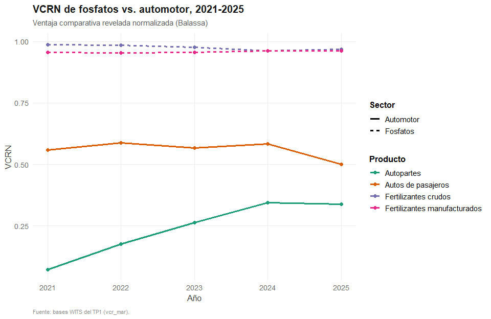
<figcaption aria-hidden="true">VCRN de fosfatos vs. automotor,
2021-2025</figcaption>
</figure>

``` r
ggsave(paste0(ruta_graficos, "grafico_vcrn_mfe.png"), g_vcrn_mfe, width = 10, height = 6.5, dpi = 300, bg = "white")
```

``` r
exportaciones_mfe_wits <- mar_exp |>
  filter(p == "WLD", cuci %in% sectores_mfe) |>
  mutate(
    sector_desc = nombres_sectores_mfe[cuci],
    grupo = if_else(cuci %in% c("272", "562"), "Fosfatos", "Automotor")
  ) |>
  select(year, cuci, sector_desc, grupo, value, share)

iic_automotor <- iic_heatmap_completo |>
  filter(cuci %in% c("781", "784")) |>
  left_join(tibble(socio = names(nombres_socio), socio_nombre = nombres_socio), by = "socio")

knitr::kable(iic_automotor, caption = "IIC de automotor por socio comercial")
```

| socio | cuci | year |       iic | cuci_desc              | socio_nombre |
|:------|:-----|-----:|----------:|:-----------------------|:-------------|
| BRA   | 781  |   NA | 0.0000000 | Passenger cars etc     | Brasil       |
| BRA   | 784  | 2024 | 0.0303815 | Motor veh parts/access | Brasil       |
| DEU   | 781  | 2024 | 1.7455947 | Passenger cars etc     | Alemania     |
| DEU   | 784  | 2024 | 1.7232623 | Motor veh parts/access | Alemania     |
| ESP   | 781  | 2024 | 0.4397573 | Passenger cars etc     | España       |
| ESP   | 784  | 2024 | 1.6482591 | Motor veh parts/access | España       |
| FRA   | 781  | 2024 | 1.4484036 | Passenger cars etc     | Francia      |
| FRA   | 784  | 2024 | 1.0792212 | Motor veh parts/access | Francia      |
| USA   | 781  | 2024 | 0.0005320 | Passenger cars etc     | EE.UU.       |
| USA   | 784  | 2024 | 3.0184616 | Motor veh parts/access | EE.UU.       |

IIC de automotor por socio comercial

## Bloque 2 - Modelo de Factores Específicos (corto plazo)

Los incisos a-d de la consigna: factor específico vs. factor móvil, FPP
cóncava y PMgL decreciente, shock de precios, y ganadores/perdedores de
corto plazo. El supuesto de que producción ≈ exportación para el sector
automotor (OICA vs. Office des Changes) se sostiene en que más del
85-90% de los vehículos ensamblados por Renault y Stellantis en
Marruecos se destinan al mercado externo europeo.

``` r
calcular_vpmgl_cobb_douglas <- function(produccion, empleo, alpha) {
  base <- inner_join(produccion, empleo, by = "year")
  col_prod <- names(produccion)[2]
  base |>
    mutate(
      producto_medio_trabajo = .data[[col_prod]] / empleo,
      pmgl_relativo = (1 - alpha) * producto_medio_trabajo
    )
}

vpmgl_fosfatos <- calcular_vpmgl_cobb_douglas(
  fosfatos_produccion, ocp_empleo_serie,
  alpha = io_coeficientes$capital_va_medio[io_coeficientes$rama == "Minería/fosfatos (B00)"]
)

vpmgl_automotor <- calcular_vpmgl_cobb_douglas(
  auto_produccion |> rename(unidades_producidas = unidades),
  auto_empleo_serie |> select(year, empleo),
  alpha = io_coeficientes$capital_va_medio[io_coeficientes$rama == "Automotor/IMME (C00)"]
)

g_productividad <- bind_rows(
  vpmgl_fosfatos |> mutate(sector = "Fosfatos"),
  vpmgl_automotor |> mutate(sector = "Automotor")
) |>
  ggplot(aes(x = year, y = producto_medio_trabajo, color = sector)) +
  geom_line(linewidth = 1.1) + geom_point(size = 2.2) +
  scale_color_manual(values = paleta_sectores) +
  scale_y_log10() +
  labs(title = "Productividad media del trabajo (proxy de VPMgL)",
       subtitle = "Producción física / empleo, escala log — solo la FORMA de cada curva importa acá",
       x = "Año", y = "Unidades físicas / empleado (log)", color = NULL,
       caption = "Calibrado con coeficientes de reparto del VA (HCP) como alpha de un Cobb-Douglas simple.") +
  theme_tp1()
g_productividad
```

<figure>
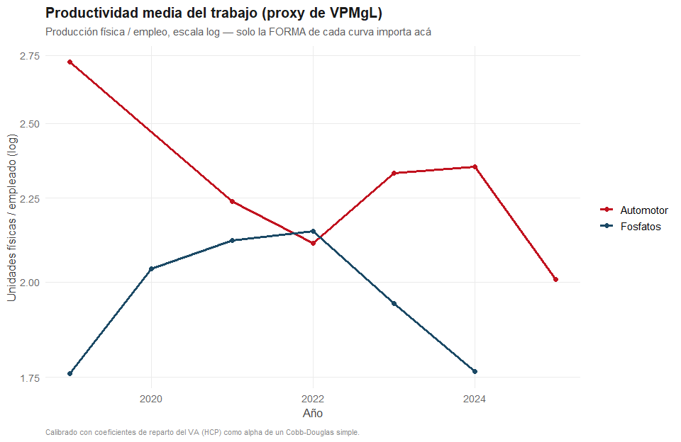
<figcaption aria-hidden="true">Productividad media del trabajo (proxy de
VPMgL)</figcaption>
</figure>

``` r
ggsave(paste0(ruta_graficos, "grafico_productividad_mfe.png"), g_productividad, width = 10, height = 6.5, dpi = 300, bg = "white")
```

### La FPP real de Marruecos

``` r
anio_ref_fpp <- 2023

L_fosfatos_0 <- ocp_empleo_serie$empleo[ocp_empleo_serie$year == anio_ref_fpp]
L_auto_0     <- auto_empleo_serie$empleo[auto_empleo_serie$year == anio_ref_fpp]
L_total      <- L_fosfatos_0 + L_auto_0

Q_fosfatos_0 <- fosfatos_produccion$produccion_mt[fosfatos_produccion$year == anio_ref_fpp]
Q_auto_0     <- auto_produccion$unidades[auto_produccion$year == anio_ref_fpp]

alpha_fosfatos <- io_coeficientes$capital_va_medio[io_coeficientes$rama == "Minería/fosfatos (B00)"]
alpha_auto     <- io_coeficientes$capital_va_medio[io_coeficientes$rama == "Automotor/IMME (C00)"]

A_fosfatos <- Q_fosfatos_0 / (L_fosfatos_0 ^ (1 - alpha_fosfatos))
A_auto     <- Q_auto_0     / (L_auto_0     ^ (1 - alpha_auto))

fpp_grilla <- tibble(L_fosfatos = seq(1000, L_total - 1000, length.out = 300)) |>
  mutate(
    L_auto     = L_total - L_fosfatos,
    Q_fosfatos = A_fosfatos * L_fosfatos ^ (1 - alpha_fosfatos),
    Q_auto     = A_auto     * L_auto     ^ (1 - alpha_auto)
  )

fpp_observado <- inner_join(
  fosfatos_produccion |> rename(Q_fosfatos = produccion_mt),
  auto_produccion |> rename(Q_auto = unidades),
  by = "year"
)

g_fpp <- ggplot() +
  geom_path(data = fpp_grilla, aes(x = Q_fosfatos, y = Q_auto), linewidth = 1.1, color = "gray30") +
  geom_point(data = fpp_observado, aes(x = Q_fosfatos, y = Q_auto, color = factor(year)), size = 3) +
  geom_text(data = fpp_observado, aes(x = Q_fosfatos, y = Q_auto, label = year), vjust = -1, size = 3) +
  labs(title = "FPP empírica de Marruecos: fosfatos vs. automotor",
       subtitle = paste0("Curva calibrada con Cobb-Douglas sobre L = ", format(L_total, big.mark = "."),
                         " trabajadores (", anio_ref_fpp, "); puntos = producción observada por año"),
       x = "Producción de fosfatos (miles de toneladas)", y = "Producción automotriz (unidades)",
       color = "Año observado",
       caption = "Curva calibrada con alpha de io_coeficientes; el punto 2023 coincide con la curva por ser el año de calibración.") +
  theme_tp1()
g_fpp
```

<figure>
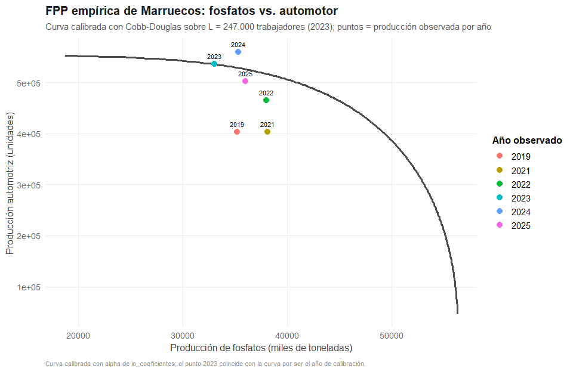
<figcaption aria-hidden="true">FPP empírica de Marruecos: fosfatos
vs. automotor</figcaption>
</figure>

``` r
ggsave(paste0(ruta_graficos, "grafico_fpp_real.png"), g_fpp, width = 10, height = 7, dpi = 300, bg = "white")
```

``` r
anios_fpp_familia <- intersect(
  intersect(ocp_empleo_serie$year, auto_empleo_serie$year[auto_empleo_serie$nota == "declarado/observado"]),
  intersect(fosfatos_produccion$year, auto_produccion$year)
)

fpp_familia <- map_dfr(anios_fpp_familia, function(anio) {
  L_f_anio <- ocp_empleo_serie$empleo[ocp_empleo_serie$year == anio]
  L_a_anio <- auto_empleo_serie$empleo[auto_empleo_serie$year == anio]
  L_tot_anio <- L_f_anio + L_a_anio
  Q_f_anio <- fosfatos_produccion$produccion_mt[fosfatos_produccion$year == anio]
  Q_a_anio <- auto_produccion$unidades[auto_produccion$year == anio]
  A_f_anio <- Q_f_anio / (L_f_anio ^ (1 - alpha_fosfatos))
  A_a_anio <- Q_a_anio / (L_a_anio ^ (1 - alpha_auto))

  tibble(year = anio, L_fosfatos = seq(1000, L_tot_anio - 1000, length.out = 200)) |>
    mutate(
      L_auto     = L_tot_anio - L_fosfatos,
      Q_fosfatos = A_f_anio * L_fosfatos ^ (1 - alpha_fosfatos),
      Q_auto     = A_a_anio * L_auto     ^ (1 - alpha_auto)
    )
})

g_fpp_desplazamiento <- ggplot() +
  geom_path(data = fpp_familia, aes(x = Q_fosfatos, y = Q_auto, color = factor(year), group = year), linewidth = 1) +
  geom_point(data = fpp_observado |> filter(year %in% anios_fpp_familia),
             aes(x = Q_fosfatos, y = Q_auto, color = factor(year)), size = 2.5) +
  labs(title = "Desplazamiento de la FPP de Marruecos, año a año",
       subtitle = "Una curva calibrada por año (no una sola curva fija) - cada punto observado cae sobre su propia curva",
       x = "Producción de fosfatos (miles de toneladas)", y = "Producción automotriz (unidades)", color = "Año",
       caption = "Cada curva recalibra A_fosfatos/A_auto con el empleo y la producción observados ESE año.") +
  theme_tp1()
g_fpp_desplazamiento
```

<figure>
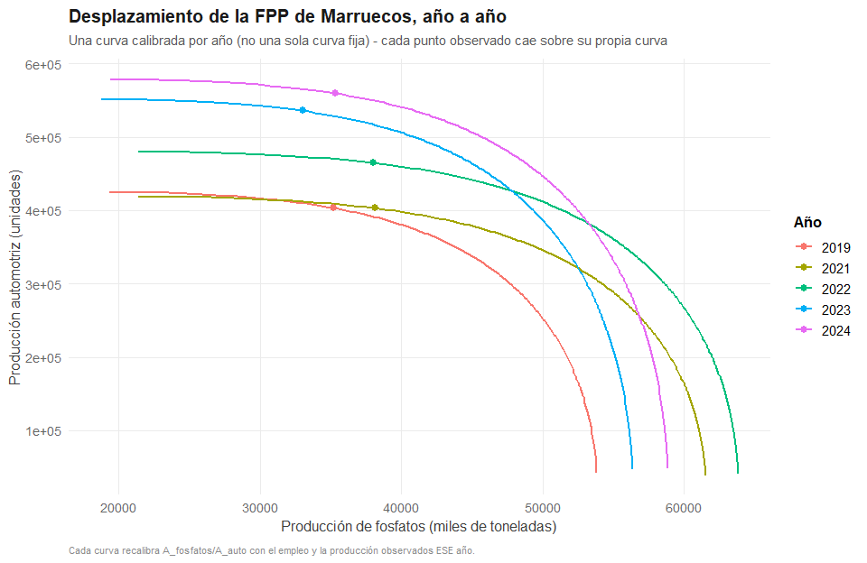
<figcaption aria-hidden="true">Desplazamiento de la FPP de Marruecos,
año a año</figcaption>
</figure>

``` r
ggsave(paste0(ruta_graficos, "grafico_fpp_desplazamiento.png"), g_fpp_desplazamiento, width = 10, height = 7, dpi = 300, bg = "white")
```

### Caja de asignación del trabajo y el hallazgo de la brecha institucional

``` r
precio_fosfatos <- ocp_financieros$ingresos_mmad[ocp_financieros$year == anio_ref_fpp] / Q_fosfatos_0
precio_auto     <- auto_exportaciones_oc$total_mmad[auto_exportaciones_oc$year == anio_ref_fpp] / Q_auto_0

caja_asignacion <- fpp_grilla |>
  mutate(
    pmgl_fosfatos  = (1 - alpha_fosfatos) * A_fosfatos * L_fosfatos ^ (-alpha_fosfatos),
    pmgl_auto      = (1 - alpha_auto)     * A_auto     * L_auto     ^ (-alpha_auto),
    vpmgl_fosfatos = precio_fosfatos * pmgl_fosfatos,
    vpmgl_auto     = precio_auto     * pmgl_auto
  )

fila_equilibrio <- caja_asignacion |> mutate(brecha = abs(vpmgl_fosfatos - vpmgl_auto)) |> slice_min(brecha, n = 1)
w_equilibrio  <- mean(c(fila_equilibrio$vpmgl_fosfatos, fila_equilibrio$vpmgl_auto))
L_fosfatos_eq <- fila_equilibrio$L_fosfatos

vpmgl_fosfatos_obs <- (1 - alpha_fosfatos) * (ocp_financieros$ingresos_mmad[ocp_financieros$year == anio_ref_fpp] / L_fosfatos_0)
vpmgl_auto_obs <- (1 - alpha_auto) * (auto_exportaciones_oc$total_mmad[auto_exportaciones_oc$year == anio_ref_fpp] / L_auto_0)
brecha_vpmgl_obs <- vpmgl_fosfatos_obs / vpmgl_auto_obs

vpmgl_fosfatos_obs_consolidado <- (1 - alpha_fosfatos) * (ocp_financieros$ingresos_mmad[ocp_financieros$year == anio_ref_fpp] / ocp_empleo_consolidado_alt)
brecha_vpmgl_obs_consolidado <- vpmgl_fosfatos_obs_consolidado / vpmgl_auto_obs

vpmgl_fosfatos_obs_oc <- (1 - alpha_fosfatos) * (auto_exportaciones_oc$fosfatos_ref_mmad[auto_exportaciones_oc$year == anio_ref_fpp] / L_fosfatos_0)
brecha_vpmgl_obs_oc <- vpmgl_fosfatos_obs_oc / vpmgl_auto_obs

tabla_robustez_vpmgl <- tibble(
  supuesto = c("Principal: 17.000 empleados, ingresos totales OCP",
               "Robustez 1: 20.000 empleados (consolidado)",
               "Robustez 2: exportación aduanera de fosfatos"),
  vpmgl_fosfatos_mmad_anio = c(vpmgl_fosfatos_obs, vpmgl_fosfatos_obs_consolidado, vpmgl_fosfatos_obs_oc),
  brecha_vs_automotor = c(brecha_vpmgl_obs, brecha_vpmgl_obs_consolidado, brecha_vpmgl_obs_oc)
)
knitr::kable(tabla_robustez_vpmgl, digits = 2, caption = "Robustez de la brecha VPMgL observada")
```

| supuesto | vpmgl_fosfatos_mmad_anio | brecha_vs_automotor |
|:---|---:|---:|
| Principal: 17.000 empleados, ingresos totales OCP | 1.07 | 3.87 |
| Robustez 1: 20.000 empleados (consolidado) | 0.91 | 3.29 |
| Robustez 2: exportación aduanera de fosfatos | 0.90 | 3.23 |

Robustez de la brecha VPMgL observada

``` r
write_csv(tabla_robustez_vpmgl, paste0(ruta_tablas, "robustez_vpmgl_observado.csv"))

g_caja_asignacion <- ggplot(caja_asignacion, aes(x = L_fosfatos)) +
  geom_line(aes(y = vpmgl_fosfatos, color = "Fosfatos"), linewidth = 1.1) +
  geom_line(aes(y = vpmgl_auto, color = "Automotor"), linewidth = 1.1) +
  geom_vline(xintercept = L_fosfatos_eq, linetype = "dashed", color = "gray40") +
  geom_hline(yintercept = w_equilibrio, linetype = "dashed", color = "gray40") +
  geom_vline(xintercept = L_fosfatos_0, linetype = "dotted", color = "gray20", linewidth = 0.8) +
  annotate("point", x = L_fosfatos_0, y = vpmgl_fosfatos_obs, size = 3, color = paleta_sectores["Fosfatos"]) +
  annotate("point", x = L_fosfatos_0, y = vpmgl_auto_obs, size = 3, color = paleta_sectores["Automotor"]) +
  coord_cartesian(ylim = c(0, 2)) +
  scale_color_manual(values = paleta_sectores) +
  labs(title = "Caja de asignación del trabajo — MFE",
       subtitle = paste0("Equilibrio teórico: w* \u2248 ", round(w_equilibrio, 3),
                         " en L_fosfatos \u2248 ", format(round(L_fosfatos_eq), big.mark = "."),
                         "  |  Observado 2023: L_fosfatos = ", format(L_fosfatos_0, big.mark = ".")),
       x = "Trabajo asignado a fosfatos (L_fosfatos)", y = "VPMgL", color = NULL,
       caption = "La distancia al equilibrio teórico refleja segmentación institucional del mercado de trabajo, no un error de unidades.") +
  theme_tp1()
g_caja_asignacion
```

<figure>
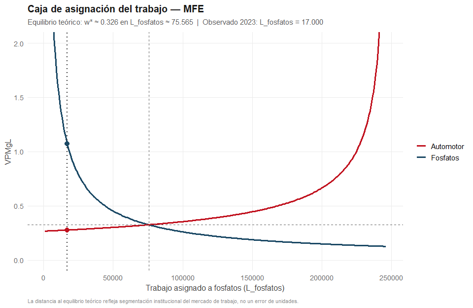
<figcaption aria-hidden="true">Caja de asignación del trabajo -
MFE</figcaption>
</figure>

``` r
ggsave(paste0(ruta_graficos, "grafico_caja_asignacion.png"), g_caja_asignacion, width = 10, height = 6.5, dpi = 300, bg = "white")
```

### ¿Cobb-Douglas es la tecnología correcta para extrapolar esto?

``` r
aL_fosfatos_leontief <- L_fosfatos_0 / Q_fosfatos_0
Q_max_fosfatos <- max(fosfatos_produccion$produccion_mt)
L_capacidad_leontief <- aL_fosfatos_leontief * Q_max_fosfatos

comparacion_tecnologias <- tibble(
  L_fosfatos_observado_2023 = L_fosfatos_0,
  L_capacidad_leontief_a_pico_historico = round(L_capacidad_leontief),
  L_fosfatos_equilibrio_cobb_douglas = round(L_fosfatos_eq)
)
knitr::kable(comparacion_tecnologias, caption = "Cobb-Douglas vs. Leontief: ¿hay margen técnico para el equilibrio teórico?")
```

| L_fosfatos_observado_2023 | L_capacidad_leontief_a_pico_historico | L_fosfatos_equilibrio_cobb_douglas |
|---:|---:|---:|
| 17000 | 19627 | 75565 |

Cobb-Douglas vs. Leontief: ¿hay margen técnico para el equilibrio
teórico?

``` r
write_csv(comparacion_tecnologias, paste0(ruta_tablas, "comparacion_leontief_cobb_douglas.csv"))

leontief_vs_cd <- tibble(L_fosfatos = seq(1000, L_total - 1000, length.out = 300)) |>
  mutate(
    Q_cobb_douglas = A_fosfatos * L_fosfatos ^ (1 - alpha_fosfatos),
    Q_leontief     = pmin(L_fosfatos / aL_fosfatos_leontief, Q_max_fosfatos)
  )

g_leontief_vs_cd <- ggplot(leontief_vs_cd, aes(x = L_fosfatos)) +
  geom_line(aes(y = Q_cobb_douglas, color = "Cobb-Douglas (sustituible)"), linewidth = 1.1) +
  geom_line(aes(y = Q_leontief, color = "Leontief (coeficientes fijos)"), linewidth = 1.1) +
  geom_vline(xintercept = L_fosfatos_0, linetype = "dotted", color = "gray30") +
  geom_vline(xintercept = L_fosfatos_eq, linetype = "dashed", color = "gray30") +
  scale_color_manual(values = c("Cobb-Douglas (sustituible)" = "gray50", "Leontief (coeficientes fijos)" = paleta_sectores[["Fosfatos"]])) +
  labs(title = "¿Qué tecnología describe mejor a la minería de fosfatos?",
       subtitle = "Producción de fosfatos bajo dos supuestos tecnológicos, calibrados en el mismo punto observado (2023)",
       x = "Trabajo asignado a fosfatos (L_fosfatos)", y = "Producción de fosfatos (miles de toneladas)", color = NULL) +
  theme_tp1()
g_leontief_vs_cd
```

<figure>
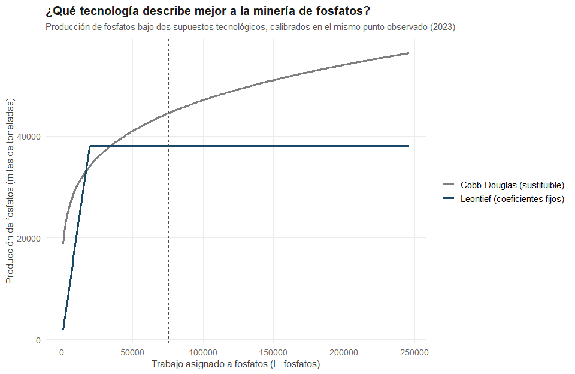
<figcaption aria-hidden="true">¿Qué tecnología describe mejor a la
minería de fosfatos?</figcaption>
</figure>

``` r
ggsave(paste0(ruta_graficos, "grafico_leontief_vs_cobb_douglas.png"), g_leontief_vs_cd, width = 10, height = 6.5, dpi = 300, bg = "white")
```

### Shock de términos de intercambio

``` r
tot_marruecos <- WDI(country = "MA", indicator = "TT.PRI.MRCH.XD.WD", start = 2015, end = 2025) |>
  as_tibble() |>
  select(year, tot = TT.PRI.MRCH.XD.WD) |>
  arrange(year)

g_tot <- ggplot(tot_marruecos, aes(x = year, y = tot)) +
  geom_line(linewidth = 1.1, color = paleta_sectores["Fosfatos"]) +
  geom_point(size = 2.2, color = paleta_sectores["Fosfatos"]) +
  labs(title = "Términos de intercambio de Marruecos",
       subtitle = "Índice de términos de intercambio de mercancías (2000=100)",
       x = "Año", y = "Índice ToT",
       caption = "Fuente: World Bank WDI. No CEPAL: no cubre países fuera de América Latina/Caribe.") +
  theme_tp1()
g_tot
```

<figure>
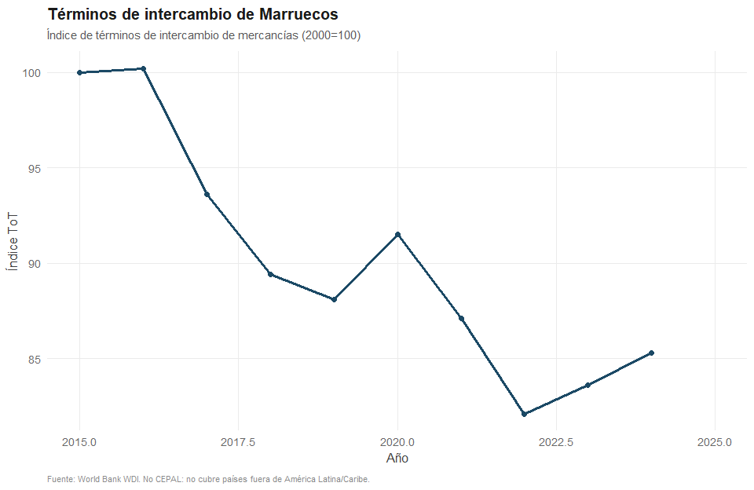
<figcaption aria-hidden="true">Términos de intercambio de
Marruecos</figcaption>
</figure>

``` r
ggsave(paste0(ruta_graficos, "grafico_tot.png"), g_tot, width = 10, height = 6, dpi = 300, bg = "white")
```

``` r
g_precios <- precios_internacionales |>
  pivot_longer(cols = c(dap_usd_mt, roca_fosforica_usd_mt), names_to = "producto", values_to = "precio") |>
  mutate(producto = recode(producto, dap_usd_mt = "DAP", roca_fosforica_usd_mt = "Roca fosfórica")) |>
  ggplot(aes(x = year, y = precio, color = producto)) +
  geom_line(linewidth = 1.1) + geom_point(size = 2.2) +
  labs(title = "Precio internacional de fertilizantes", subtitle = "USD por tonelada métrica, f.o.b.",
       x = "Año", y = "USD/mt", color = NULL, caption = "Fuente: World Bank Commodity Markets (Pink Sheet).") +
  theme_tp1()
g_precios
```

<figure>
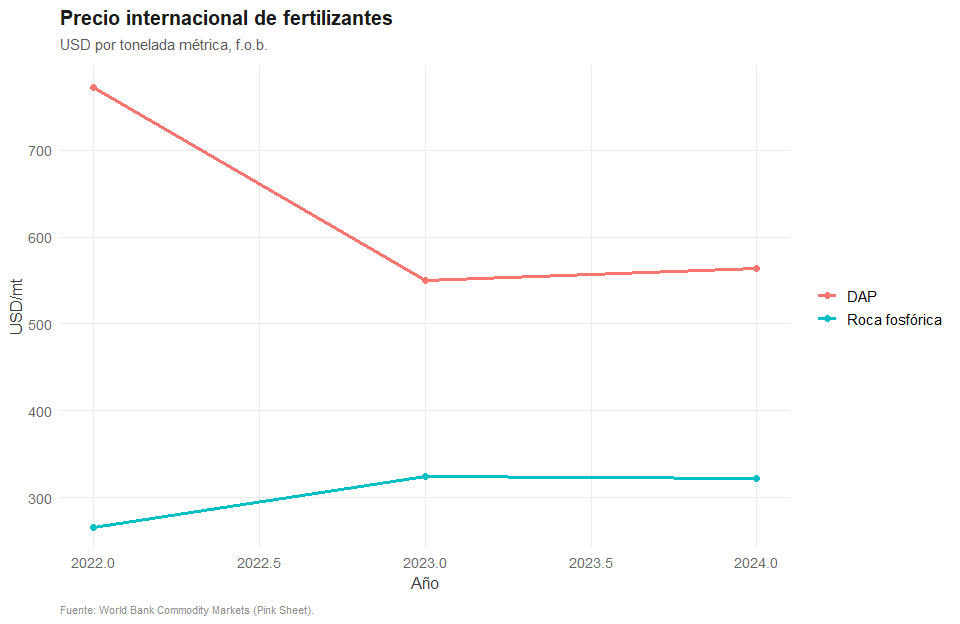
<figcaption aria-hidden="true">Precio internacional de
fertilizantes</figcaption>
</figure>

``` r
ggsave(paste0(ruta_graficos, "grafico_precios_internacionales.png"), g_precios, width = 10, height = 6, dpi = 300, bg = "white")
```

## Bloque 3 - Modelo de Heckscher-Ohlin (largo plazo)

``` r
productividad_valor_fosfatos <- inner_join(ocp_financieros |> select(year, ingresos_mmad), ocp_empleo_serie, by = "year") |>
  mutate(valor_por_trabajador_mmad = ingresos_mmad / empleo, sector = "Fosfatos")

productividad_valor_auto <- inner_join(auto_exportaciones_oc |> select(year, total_mmad), auto_empleo_serie |> select(year, empleo), by = "year") |>
  mutate(valor_por_trabajador_mmad = total_mmad / empleo, sector = "Automotor")

brecha_valor_trabajador <- bind_rows(
  productividad_valor_fosfatos |> select(year, sector, valor_por_trabajador_mmad),
  productividad_valor_auto     |> select(year, sector, valor_por_trabajador_mmad)
) |>
  pivot_wider(names_from = sector, values_from = valor_por_trabajador_mmad) |>
  mutate(brecha_veces = Fosfatos / Automotor)

knitr::kable(brecha_valor_trabajador, digits = 2, caption = "Brecha de valor generado por trabajador, fosfatos vs. automotor")
```

| year | Fosfatos | Automotor | brecha_veces |
|-----:|---------:|----------:|-------------:|
| 2021 |     4.69 |      0.47 |        10.08 |
| 2022 |     6.48 |      0.51 |        12.81 |
| 2023 |     5.37 |      0.62 |         8.71 |
| 2024 |     4.85 |      0.66 |         7.32 |
| 2019 |       NA |      0.52 |           NA |
| 2020 |       NA |      0.45 |           NA |
| 2025 |       NA |      0.62 |           NA |

Brecha de valor generado por trabajador, fosfatos vs. automotor

``` r
data("pwt10.01", package = "pwt10")
paises_benchmark <- c("Morocco", "Germany", "Spain", "France")

kl_benchmark <- pwt10.01 |>
  filter(country %in% paises_benchmark) |>
  mutate(kl = rnna / emp) |>
  select(country, year, kl, hc, labsh)

g_kl <- kl_benchmark |>
  filter(year >= 2000) |>
  ggplot(aes(x = year, y = kl, color = country)) +
  geom_line(linewidth = 1.1) +
  scale_color_manual(values = paleta_paises_ho) +
  labs(title = "Capital por trabajador (K/L)", subtitle = "Marruecos vs. Alemania, España y Francia",
       x = "Año", y = "K/L (PWT rnna/emp)", color = NULL,
       caption = "Fuente: Penn World Table 10.01 (cobertura hasta 2019 - no faltan años recientes, es el límite de la versión pública del paquete pwt10).") +
  theme_tp1()
g_kl
```

<figure>
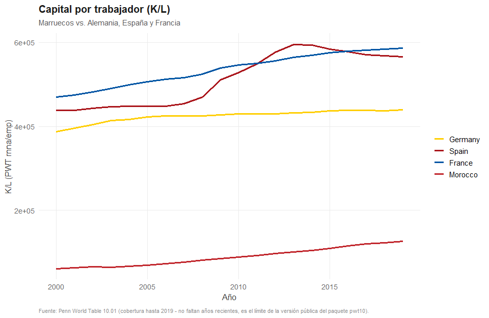
<figcaption aria-hidden="true">Capital por trabajador (K/L)</figcaption>
</figure>

``` r
ggsave(paste0(ruta_graficos, "grafico_kl_benchmark.png"), g_kl, width = 10, height = 6.5, dpi = 300, bg = "white")
```

``` r
g_labsh <- pwt10.01 |>
  filter(country == "Morocco") |>
  ggplot(aes(x = year, y = labsh)) +
  geom_line(linewidth = 1.1, color = paleta_sectores["Automotor"]) +
  labs(title = "Participación del trabajo en el ingreso — Marruecos",
       subtitle = "Insumo para testear Stolper-Samuelson de largo plazo",
       x = "Año", y = "labsh (PWT)", caption = "Fuente: Penn World Table 10.01 (cobertura hasta 2019).") +
  theme_tp1()
g_labsh
```

<figure>
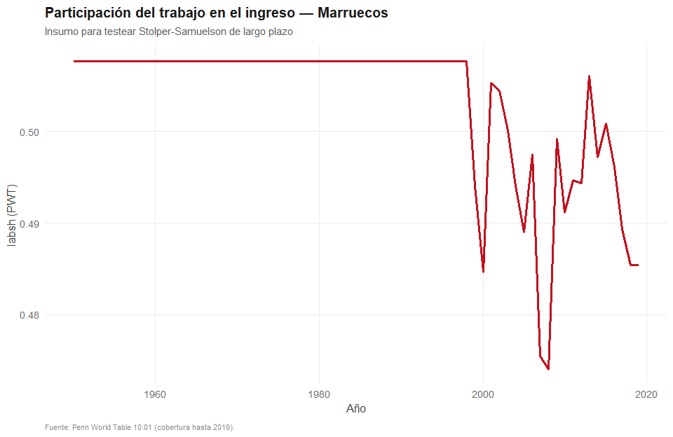
<figcaption aria-hidden="true">Participación del trabajo en el ingreso —
Marruecos</figcaption>
</figure>

``` r
ggsave(paste0(ruta_graficos, "grafico_labsh_marruecos.png"), g_labsh, width = 10, height = 6, dpi = 300, bg = "white")
```

``` r
g_ied_origen <- ggplot(ied_origen_pais_2020, aes(x = reorder(pais, stock_mmad), y = stock_mmad)) +
  geom_col(fill = paleta_sectores["Automotor"]) +
  coord_flip() +
  labs(title = "Stock de IED en Marruecos por país de origen", subtitle = "2020, millones de MAD",
       x = NULL, y = "Millones de MAD", caption = "Fuente: Office des Changes (PEG 2020) / DG Trésor / UNCTADstat.") +
  theme_tp1()
g_ied_origen
```

<figure>
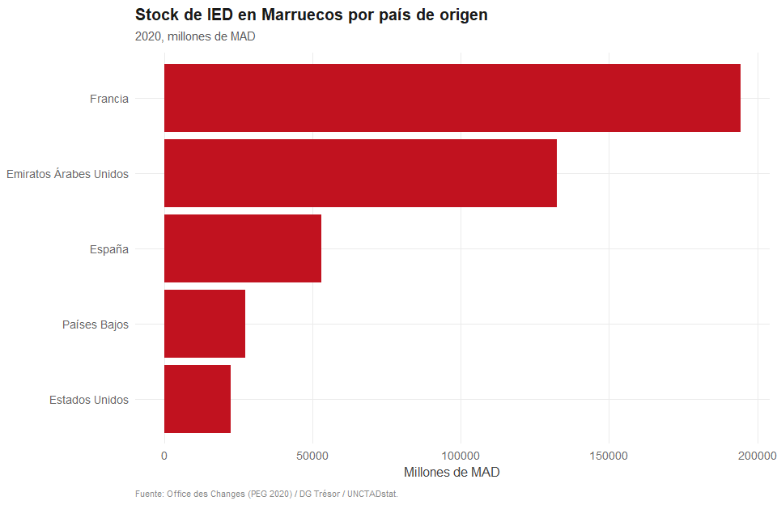
<figcaption aria-hidden="true">Stock de IED en Marruecos por país de
origen</figcaption>
</figure>

``` r
ggsave(paste0(ruta_graficos, "grafico_ied_origen.png"), g_ied_origen, width = 9, height = 6, dpi = 300, bg = "white")
```

## Bloque 4 - Síntesis y política

El excedente de VPMgL que OCP no distribuye como salario se capta como
dividendo del Estado y financia en parte la Caisse de Compensation.
Régimen fiscal de AMDIE para la inversión automotriz: Exoneración IS 5
años + 15% posterior; primas hasta 30%.

## Conclusiones

*(completar tras revisar los gráficos y tablas de arriba - ver
`TP2_revision_script_fpp_caja_asignacion.md` y
`TP2_Analisis_Gap_Caja_Asignacion_MFE.md` para los puntos ya discutidos
sobre la brecha VPMgL y la comparación Cobb-Douglas/Leontief)*
